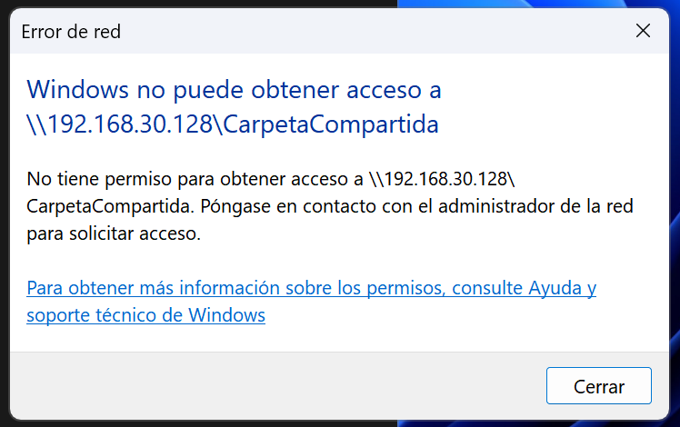
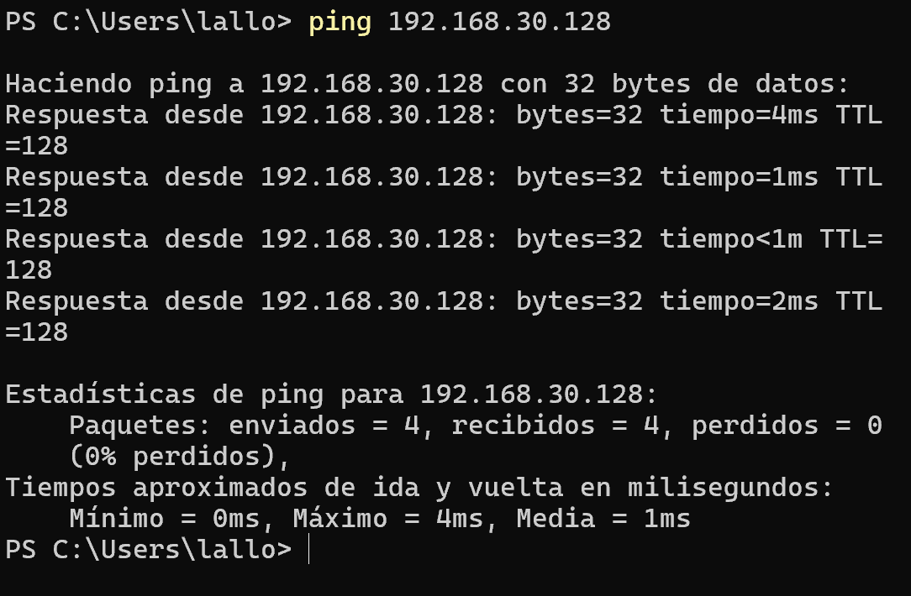
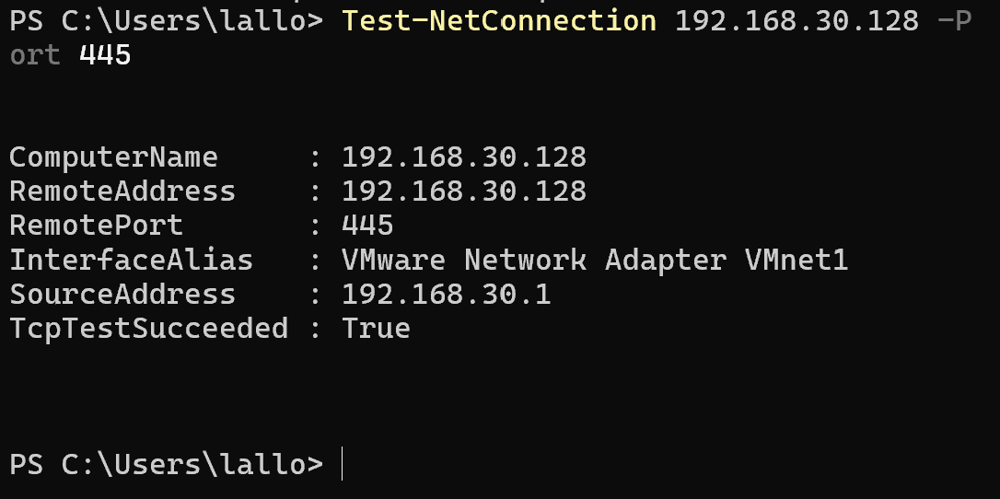
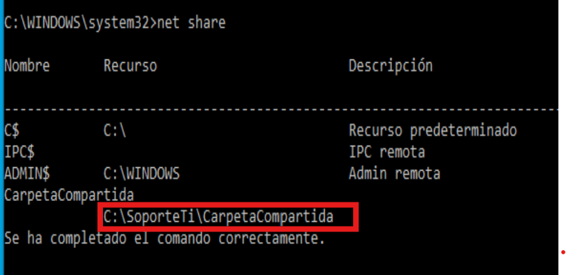
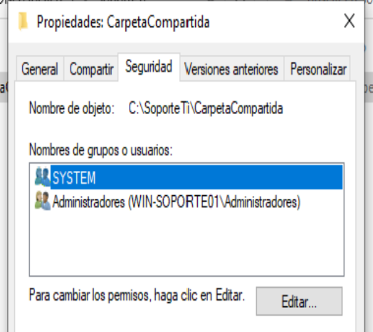
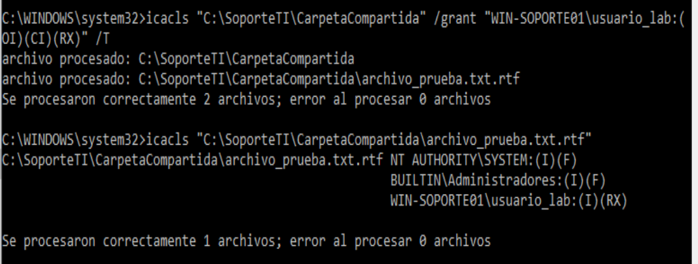
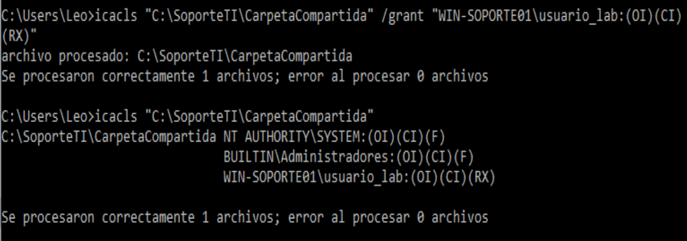
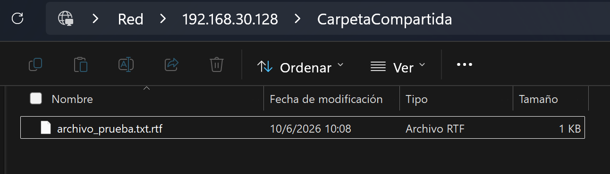
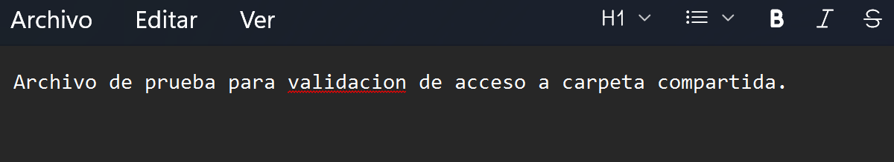
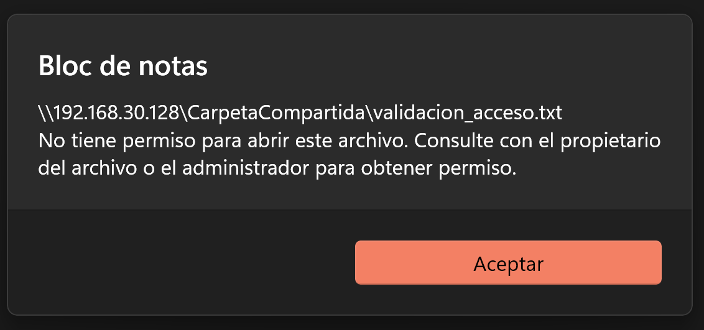

# Caso Help Desk: Usuario sin acceso a carpeta compartida en Windows

## Objetivo

Documentar un caso de soporte técnico donde un usuario no puede acceder a una carpeta compartida en red desde un equipo Windows.

El objetivo fue diagnosticar si el problema estaba relacionado con conectividad, disponibilidad del servicio SMB, existencia del recurso compartido o permisos de acceso. Después se aplicó una corrección controlada usando permisos NTFS y se validó que el usuario pudiera leer el contenido sin recibir permisos excesivos.

## Entorno utilizado

* Windows 11 como equipo cliente.
* Windows 10 como equipo que comparte el recurso.
* Red privada de laboratorio.
* Carpeta compartida por SMB.
* PowerShell.
* Símbolo del sistema como administrador.
* Permisos NTFS.
* Recurso compartido de Windows.

## Descripción del caso

El usuario reportó que no podía acceder a una carpeta compartida en red.

Al intentar abrir el recurso compartido, Windows mostraba un mensaje indicando que el usuario no tenía permiso para acceder a la carpeta.

Ruta reportada:

```text
\\192.168.30.128\CarpetaCompartida
```

Mensaje observado:

```text
No tiene permiso para obtener acceso a \\192.168.30.128\CarpetaCompartida.
Póngase en contacto con el administrador de la red para solicitar acceso.
```

## Impacto

El usuario podía llegar al equipo en red, pero no podía acceder al contenido compartido necesario para trabajar.

* Tipo de caso: Incidente de acceso a recurso compartido.
* Prioridad asignada: Media.
* Servicio afectado: Carpeta compartida en Windows.
* Estado final: Resuelto.

## Procedimiento realizado

### 1. Validación del error reportado

Se intentó acceder a la carpeta compartida desde el equipo cliente usando la ruta UNC del recurso.

```text
\\192.168.30.128\CarpetaCompartida
```

Windows mostró un error de permisos, indicando que el usuario no tenía autorización para acceder al recurso.

**Evidencia:**



---

### 2. Validación de conectividad con el equipo remoto

Se ejecutó una prueba de conectividad hacia el equipo que aloja la carpeta compartida.

```powershell
ping 192.168.30.128
```

El resultado mostró respuesta correcta desde el equipo remoto, con 0% de pérdida de paquetes.

Esto permitió descartar una falla básica de conectividad IP entre el equipo cliente y el equipo que comparte la carpeta.

**Evidencia:**



---

### 3. Validación del puerto SMB 445

Después de confirmar conectividad IP, se validó si el servicio SMB estaba respondiendo en el puerto 445.

```powershell
Test-NetConnection 192.168.30.128 -Port 445
```

El resultado mostró:

```text
TcpTestSucceeded : True
```

Esto confirmó que el servicio de archivos compartidos de Windows estaba disponible desde el equipo cliente.

**Evidencia:**



---

### 4. Validación del recurso compartido

En el equipo que aloja la carpeta, se revisó si el recurso compartido existía y estaba publicado correctamente.

```cmd
net share
```

El recurso `CarpetaCompartida` apareció en la lista de recursos compartidos.

Esto permitió descartar que el problema fuera causado por una carpeta no compartida o por un nombre de recurso incorrecto.

**Evidencia:**



---

### 5. Revisión de permisos NTFS

Se revisaron los permisos de seguridad de la carpeta compartida.

La revisión mostró que el usuario no tenía permisos NTFS suficientes para acceder al contenido. La carpeta estaba compartida, pero a nivel de seguridad local solo contaba con permisos para cuentas administrativas y del sistema.

Esto explicó por qué el recurso existía, respondía por red y tenía SMB disponible, pero el usuario seguía recibiendo error de acceso.

**Evidencia:**



---

### 6. Corrección de permisos NTFS de forma recursiva

Se aplicaron permisos de lectura y ejecución al usuario correspondiente sobre la carpeta compartida y su contenido.

```cmd
icacls "C:\SoporteTI\CarpetaCompartida" /grant "WIN-SOPORTE01\usuario_lab:(OI)(CI)(RX)" /T
```

La corrección se aplicó de forma recursiva para que el usuario pudiera acceder tanto a la carpeta como a los archivos internos.

El resultado indicó que los archivos fueron procesados correctamente y que no hubo errores.

**Evidencia:**



---

### 7. Verificación del permiso aplicado al usuario

Se validó que el usuario tuviera permisos de lectura y ejecución sobre el recurso.

La verificación mostró que `usuario_lab` tenía permisos `RX`, correspondientes a lectura y ejecución.

**Evidencia:**



---

### 8. Validación de acceso a la carpeta compartida

Después de aplicar la corrección, se intentó acceder nuevamente al recurso compartido desde el equipo cliente.

El usuario pudo entrar correctamente a la carpeta compartida y visualizar el contenido.

**Evidencia:**



---

### 9. Validación de lectura del archivo compartido

Se abrió un archivo de prueba dentro de la carpeta compartida para confirmar que el usuario podía leer el contenido.

El archivo se abrió correctamente desde el recurso compartido.

**Evidencia:**



---

### 10. Validación de mínimo privilegio

Se intentó modificar y guardar el archivo desde el equipo cliente.

Windows mostró un mensaje indicando que el usuario no tenía permiso para guardar cambios sobre el archivo original en la carpeta compartida.

Esto confirmó que el usuario podía leer el contenido, pero no modificarlo. La corrección se aplicó siguiendo el principio de mínimo privilegio.

**Evidencia:**



## Explicación de comandos utilizados

### `ping 192.168.30.128`

```powershell
ping 192.168.30.128
```

Este comando se utilizó para validar conectividad básica entre el equipo cliente y el equipo que aloja la carpeta compartida.

Desglose:

* `ping`: herramienta de diagnóstico de red que envía paquetes ICMP Echo Request.
* `192.168.30.128`: dirección IP del equipo remoto.
* Respuestas recibidas: indican que el equipo remoto responde en red.
* 0% de pérdida: indica que no hubo pérdida de paquetes durante la prueba.

Uso dentro del caso:

Este comando permitió confirmar que el equipo cliente sí podía comunicarse con el equipo remoto. Por lo tanto, el problema no parecía estar en la conectividad IP básica.

---

### `Test-NetConnection 192.168.30.128 -Port 445`

```powershell
Test-NetConnection 192.168.30.128 -Port 445
```

Este comando se utilizó para validar si el servicio SMB estaba disponible en el equipo remoto.

Desglose:

* `Test-NetConnection`: cmdlet de PowerShell usado para probar conectividad de red.
* `192.168.30.128`: dirección IP del equipo que aloja la carpeta compartida.
* `-Port`: parámetro que permite probar un puerto específico.
* `445`: puerto TCP usado por SMB para compartir archivos e impresoras en Windows.
* `TcpTestSucceeded : True`: indica que el puerto respondió correctamente.

Uso dentro del caso:

El `ping` solo confirma que el equipo responde en red, pero no confirma que el servicio de carpetas compartidas esté disponible. Con `Test-NetConnection` se validó que el puerto SMB 445 estaba accesible.

---

### `net share`

```cmd
net share
```

Este comando se utilizó en el equipo que aloja la carpeta compartida para listar los recursos compartidos disponibles.

Desglose:

* `net`: herramienta de administración de red de Windows.
* `share`: subcomando que muestra los recursos compartidos configurados en el equipo.

Uso dentro del caso:

El comando permitió confirmar que `CarpetaCompartida` existía como recurso compartido. Esto ayudó a descartar que el error fuera causado por un recurso inexistente o mal publicado.

---

### `icacls "C:\SoporteTI\CarpetaCompartida"`

```cmd
icacls "C:\SoporteTI\CarpetaCompartida"
```

Este comando se utilizó para revisar los permisos NTFS de la carpeta compartida.

Desglose:

* `icacls`: herramienta de Windows para ver y modificar listas de control de acceso.
* `"C:\SoporteTI\CarpetaCompartida"`: ruta local de la carpeta revisada.
* Las comillas se usan porque la ruta puede contener caracteres especiales o espacios.
* La salida muestra usuarios, grupos y permisos asociados.

Uso dentro del caso:

Este comando permitió identificar que el usuario no tenía permisos NTFS suficientes para acceder al contenido de la carpeta.

---

### `icacls "C:\SoporteTI\CarpetaCompartida" /grant "WIN-SOPORTE01\usuario_lab:(OI)(CI)(RX)" /T`

```cmd
icacls "C:\SoporteTI\CarpetaCompartida" /grant "WIN-SOPORTE01\usuario_lab:(OI)(CI)(RX)" /T
```

Este comando se utilizó para otorgar permisos de lectura y ejecución al usuario sobre la carpeta compartida y su contenido.

Desglose:

* `icacls`: herramienta para administrar permisos NTFS.
* `"C:\SoporteTI\CarpetaCompartida"`: carpeta donde se aplican los permisos.
* `/grant`: parámetro que permite conceder permisos.
* `"WIN-SOPORTE01\usuario_lab:(OI)(CI)(RX)"`: usuario y permisos asignados.
* `WIN-SOPORTE01`: nombre del equipo donde existe el usuario local.
* `usuario_lab`: usuario al que se le concedió acceso.
* `(OI)`: Object Inherit. Permite que los archivos dentro de la carpeta hereden el permiso.
* `(CI)`: Container Inherit. Permite que las subcarpetas hereden el permiso.
* `(RX)`: Read and Execute. Permite leer y ejecutar, pero no modificar.
* `/T`: aplica el cambio de forma recursiva a la carpeta y su contenido.

Uso dentro del caso:

Este comando corrigió el problema de acceso sin dar permisos excesivos. El usuario recibió permisos para leer el contenido, pero no para modificarlo.

## Resultado

El usuario pudo acceder correctamente a la carpeta compartida y leer el archivo de prueba.

La validación final confirmó que el usuario no podía modificar el archivo original, por lo que la corrección respetó el principio de mínimo privilegio.

## Resumen técnico del ticket

**Problema reportado:**
Usuario sin acceso a carpeta compartida en Windows.

**Diagnóstico:**
Se confirmó conectividad con el equipo remoto, disponibilidad del puerto SMB 445 y existencia del recurso compartido. La causa del problema estaba en los permisos NTFS de la carpeta.

**Acción aplicada:**
Se otorgaron permisos de lectura y ejecución al usuario correspondiente usando `icacls`, aplicando los permisos de forma recursiva a la carpeta y su contenido.

**Resultado:**
El usuario pudo acceder y leer el contenido de la carpeta compartida, sin permisos para modificar archivos.

**Estado:**
Resuelto.

## Competencias demostradas

* Diagnóstico de acceso a recurso compartido en Windows.
* Validación de conectividad con `ping`.
* Validación de disponibilidad SMB por puerto 445.
* Revisión de recursos compartidos con `net share`.
* Análisis de permisos NTFS.
* Corrección de permisos con `icacls`.
* Aplicación del principio de mínimo privilegio.
* Documentación técnica orientada a Soporte TI / Help Desk.
* Validación final de solución.

## Conclusión

Este caso demuestra un flujo realista de soporte técnico para un problema de acceso a carpeta compartida en Windows.

El diagnóstico permitió descartar problemas de conectividad, servicio SMB y publicación del recurso. La causa real fue la falta de permisos NTFS para el usuario. La solución consistió en otorgar permisos de lectura y ejecución de forma controlada, permitiendo el acceso necesario sin conceder permisos de modificación o control total.
