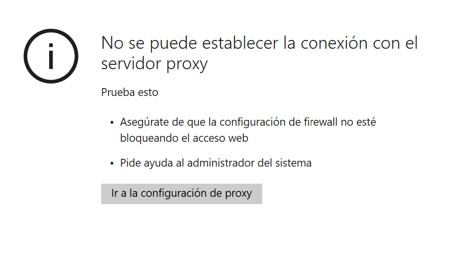
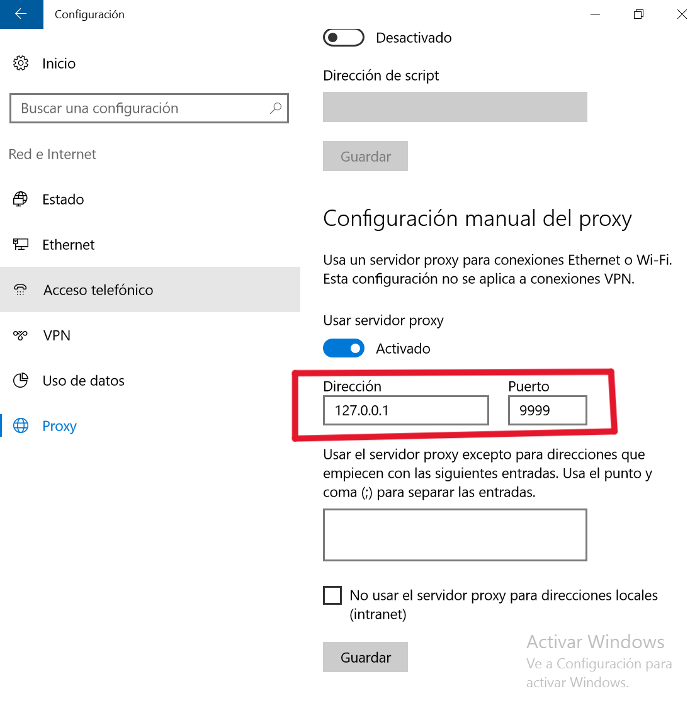
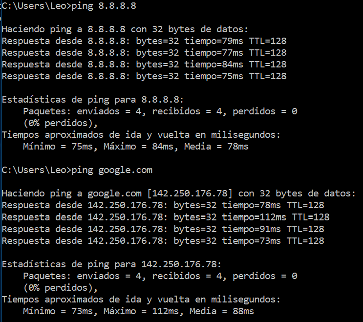
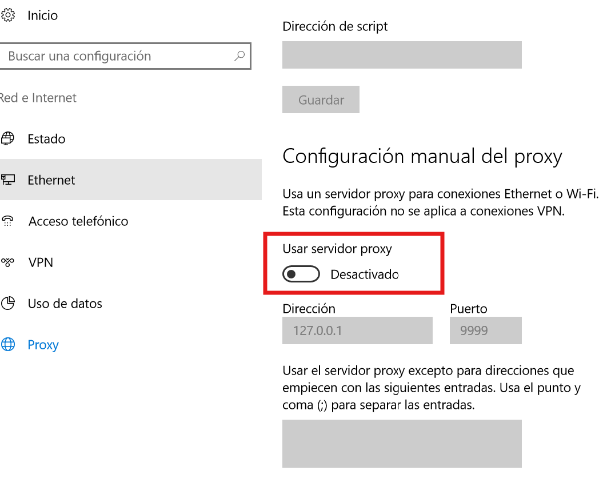
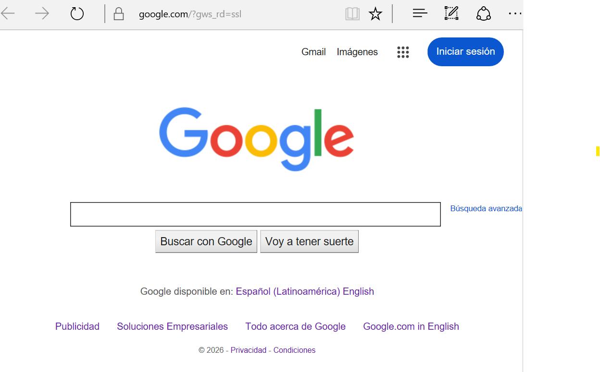

# Caso Help Desk: navegador sin acceso por proxy mal configurado

## Objetivo

Documentar un caso práctico de Help Desk donde un usuario no puede acceder a páginas web debido a una configuración manual de proxy incorrecta en Windows 10.

El laboratorio muestra el proceso completo de atención: recepción del caso, preguntas iniciales, validación del problema, revisión técnica, corrección, confirmación con el usuario y cierre del ticket.

---

## Escenario

Un usuario contacta al área de soporte porque no puede abrir páginas web desde su equipo Windows 10.

El problema ocurre únicamente en su computadora. Otros equipos y dispositivos de la red sí pueden navegar correctamente.

---

## Medio de atención

| Campo | Detalle |
|---|---|
| Canal de atención | Chat de soporte |
| Tipo de intervención | Asistencia remota autorizada |
| Equipo afectado | Windows 10 |
| Técnico asignado | Lallonerd González Serrano |

El usuario reporta el problema por chat. Después de recopilar información inicial, se solicita autorización para revisar la configuración del equipo mediante asistencia remota.

---

## Ticket inicial

| Campo | Detalle |
|---|---|
| Número de ticket | HD-005 |
| Título | Usuario no puede acceder a páginas web |
| Reportado por | Usuario final |
| Fecha de creación | 2026-05-27 |
| Categoría | Navegación web / Red / Proxy |
| Prioridad | Media |
| Estado inicial | Abierto |
| Creado por | Lallonerd González Serrano |
| Asignado a | Lallonerd González Serrano |

### Descripción inicial

El usuario indica que no puede acceder a páginas web desde su equipo Windows 10. El problema inició esta mañana y el día anterior el navegador funcionaba correctamente.

La prioridad se clasifica como **media** porque el problema afecta a un solo equipo y otros dispositivos de la red sí tienen acceso a Internet.

---

## Recopilación de información con el usuario

| Pregunta del técnico | Respuesta del usuario |
|---|---|
| ¿Desde cuándo le sucede? | Desde esta mañana. Ayer funcionaba normal. |
| ¿Le pasa con todas las páginas o solo con una? | Me pasa con todas las páginas. |
| ¿Está conectado por cable o Wi-Fi? | Está conectado por cable. |
| ¿Otros equipos o dispositivos pueden acceder a Internet normalmente? | Sí, otros equipos sí pueden navegar. |
| ¿Antes de que empezara el problema, alguien tocó alguna configuración de Internet en la computadora? | Sí, ayer alguien intentó configurar algo para entrar a una página del trabajo. |
| ¿Le aparece algún mensaje de error en el navegador? | Sí, me aparece un mensaje que dice: “No se puede establecer la conexión con el servidor proxy”. |

### Validación inicial

Con la información recopilada, el caso se considera válido.  
El error afecta la navegación web del usuario y el mensaje del navegador da una pista inicial relacionada con la configuración de proxy.

En este punto todavía no se confirma la causa final. Se continúa con la revisión técnica del equipo.

---

## Autorización de asistencia remota

Antes de revisar la configuración del equipo, se solicita autorización al usuario.

**Mensaje al usuario:**

> Gracias por la información. El mensaje del navegador indica que puede haber un problema con la configuración de Internet del equipo. ¿Me autoriza a revisar la configuración de red y proxy de forma remota?

**Respuesta del usuario:**

> Sí, autorizado.

---

## Evidencia 01: Error en el navegador

Se valida el problema reportado por el usuario abriendo el navegador.

El navegador muestra un mensaje indicando que no se puede establecer conexión con el servidor proxy.



### Análisis

El mensaje del navegador indica que el equipo está intentando usar un servidor proxy, pero no logra establecer conexión.

Esto orienta la revisión hacia la configuración de proxy del sistema.

---

## Evidencia 02: Proxy manual mal configurado

Se revisa la configuración de proxy en Windows.

Ruta utilizada:

```text
Inicio → Configuración → Red e Internet → Proxy
```

Se identifica que la opción **Usar servidor proxy** está activada manualmente con los siguientes valores:

```text
Dirección: 127.0.0.1
Puerto: 9999
```



### Análisis

La dirección `127.0.0.1` apunta al propio equipo local. En este caso, no existe un servidor proxy funcionando en el puerto `9999`.

Por esta razón, el navegador intenta enviar la navegación web hacia un proxy local inexistente y no puede cargar páginas.

---

## Evidencia 03: Validación de conectividad de red

Antes de corregir el proxy, se valida que la conexión de red y la resolución DNS funcionan correctamente desde CMD.

Comandos utilizados:

```cmd
ping 8.8.8.8
ping google.com
```



### Resultado observado

- `ping 8.8.8.8`: exitoso.
- `ping google.com`: exitoso.
- Pérdida de paquetes: 0%.

### Análisis

La conectividad de red funciona correctamente.  
También se confirma que el equipo puede resolver nombres de dominio.

Esto descarta una caída general de red o un fallo DNS. El problema está relacionado con la configuración de proxy usada por el navegador/sistema.

---

## Evidencia 04: Proxy manual desactivado

Se corrige la configuración desde la interfaz gráfica de Windows.

Acción realizada:

```text
Desactivar → Usar servidor proxy
```



### Análisis

La corrección se realizó desde la configuración de Windows, desactivando solo el proxy manual que causaba el problema.

No fue necesario modificar la dirección IP, DNS, firewall ni otros parámetros de red.

---

## Evidencia 05: Navegador funcionando correctamente

Después de desactivar el proxy manual, se abre nuevamente el navegador y se valida el acceso a una página web.



### Resultado observado

El navegador vuelve a cargar páginas web correctamente.

---

## Actualizaciones del ticket

| Hora | Actualización |
|---|---|
| 09:00 | Usuario reporta por chat que no puede acceder a páginas web. |
| 09:05 | Se realizan preguntas iniciales para identificar el alcance del problema. |
| 09:10 | Usuario confirma que otros equipos sí navegan correctamente. |
| 09:12 | Se solicita autorización para revisar el equipo mediante asistencia remota. |
| 09:15 | Se valida el error del navegador relacionado con servidor proxy. |
| 09:20 | Se revisa la configuración de proxy en Windows. |
| 09:25 | Se identifica un proxy manual configurado con `127.0.0.1:9999`. |
| 09:30 | Se valida conectividad de red mediante `ping 8.8.8.8` y `ping google.com`. |
| 09:35 | Se desactiva el proxy manual desde la configuración de Windows. |
| 09:40 | Se confirma que el navegador vuelve a cargar páginas web. |
| 09:45 | Se informa al usuario y se cierra el ticket. |

---

## Resolución del caso

Se identificó que el equipo tenía activada una configuración manual de proxy incorrecta.

La conexión de red funcionaba correctamente, pero el navegador intentaba conectarse a Internet mediante un proxy local inexistente.

La solución aplicada fue desactivar la opción **Usar servidor proxy** desde la configuración de Windows.

---

## Mensaje final al usuario

Se revisó la configuración del equipo y se encontró que el navegador estaba intentando conectarse mediante un proxy configurado incorrectamente.

Se desactivó esa configuración y se confirmó que las páginas web cargan nuevamente.

El caso queda resuelto y cerrado.

---

## Estado final del ticket

| Campo | Resultado |
|---|---|
| Estado final | Cerrado |
| Resolución | Solucionado sin escalamiento |
| Causa identificada | Proxy manual mal configurado |
| Acción aplicada | Desactivación del proxy manual |
| Validación final | Navegador funcionando correctamente |

---

## Habilidades demostradas

- Atención inicial a usuario.
- Recopilación de información mediante preguntas claras.
- Validación del alcance del incidente.
- Clasificación básica de prioridad.
- Revisión de configuración de proxy en Windows.
- Pruebas básicas de conectividad con `ping`.
- Corrección desde interfaz gráfica.
- Documentación de actualizaciones del ticket.
- Cierre de caso sin escalamiento.
