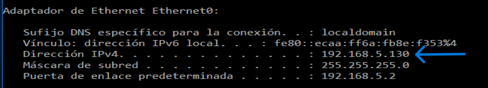
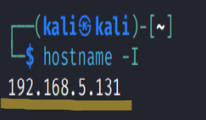
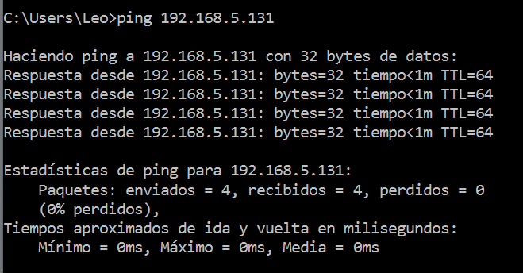
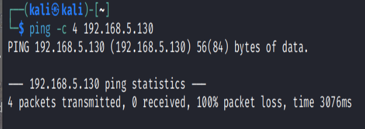
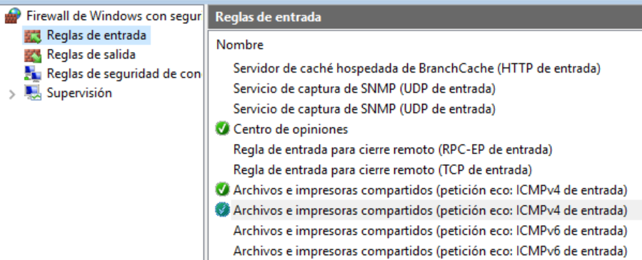
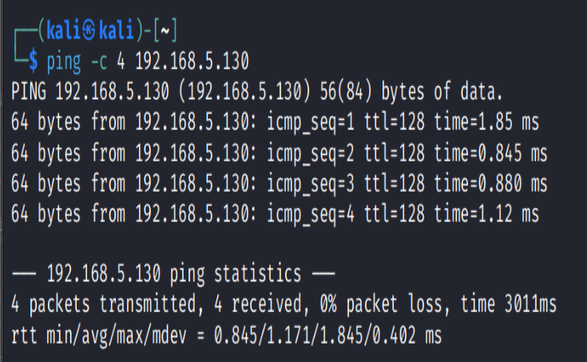

# Prueba de conectividad entre equipos virtuales

## Objetivo

Verificar la conectividad entre dos equipos virtuales dentro de la misma red local y documentar un caso básico donde el Firewall de Windows bloquea las solicitudes de ping entrantes.

Este laboratorio forma parte de mi portafolio técnico de **Soporte TI, Help Desk y diagnóstico de red**.

---

## Escenario

Se utilizaron dos máquinas virtuales:

- Windows 10
- Kali Linux

Ambas máquinas se encuentran dentro de la misma red `192.168.5.0/24`.

Durante la prueba, Windows pudo comunicarse con Kali correctamente. Sin embargo, Kali no pudo comunicarse inicialmente con Windows mediante `ping`, debido a que Windows Firewall bloqueaba las solicitudes ICMP entrantes.

La corrección se realizó desde la interfaz gráfica de Windows, habilitando la regla correspondiente para permitir peticiones eco ICMPv4.

---

## Herramientas utilizadas

- Windows 10
- Kali Linux
- CMD
- Terminal de Kali
- Firewall de Windows con seguridad avanzada
- `ipconfig`
- `hostname -I`
- `ping`

---

## Evidencia 01: Dirección IP de Windows 10

Se ejecutó el comando:

```cmd
ipconfig
```

Este comando permite identificar la dirección IPv4, máscara de subred y puerta de enlace del equipo Windows.



### Resultado observado

- Dirección IPv4 de Windows: `192.168.5.130`
- Máscara de subred: `255.255.255.0`
- Puerta de enlace predeterminada: `192.168.5.2`

### Análisis

Windows se encuentra dentro de la red `192.168.5.0/24`.

---

## Evidencia 02: Dirección IP de Kali Linux

Se ejecutó el comando:

```bash
hostname -I
```

Este comando permite mostrar la dirección IP asignada al equipo Kali Linux.



### Resultado observado

- Dirección IP de Kali Linux: `192.168.5.131`

### Análisis

Kali Linux también se encuentra dentro de la red `192.168.5.0/24`.

Esto confirma que ambas máquinas virtuales están en la misma red local.

---

## Evidencia 03: Ping desde Windows hacia Kali

Desde Windows se ejecutó el comando:

```cmd
ping 192.168.5.131
```

Esta prueba permite validar si Windows puede comunicarse con Kali Linux.



### Resultado observado

- Paquetes enviados: 4
- Paquetes recibidos: 4
- Paquetes perdidos: 0
- Pérdida: 0%

### Análisis

Windows pudo comunicarse correctamente con Kali Linux.

Esto confirma que existe conectividad desde Windows hacia Kali dentro de la red local.

---

## Evidencia 04: Ping desde Kali hacia Windows bloqueado

Desde Kali Linux se ejecutó el comando:

```bash
ping -c 4 192.168.5.130
```

La opción `-c 4` indica que Kali debe enviar solo 4 paquetes de ping y detener la prueba automáticamente.



### Resultado observado

- Paquetes transmitidos: 4
- Paquetes recibidos: 0
- Pérdida: 100%

### Análisis

Kali no pudo comunicarse inicialmente con Windows.

Como ambas máquinas estaban en la misma red y Windows sí podía comunicarse con Kali, el problema no parecía estar en la configuración IP.

La causa probable era que Windows Firewall estaba bloqueando las solicitudes ICMP entrantes.

---

## Evidencia 05: Habilitación de regla ICMPv4 en Firewall de Windows

Se abrió la herramienta:

```text
Firewall de Windows con seguridad avanzada
```

Luego se ingresó a:

```text
Reglas de entrada
```

Y se habilitó la regla:

```text
Archivos e impresoras compartidos (petición eco: ICMPv4 de entrada)
```



### Análisis

No se desactivó el firewall completo.

Solo se habilitó la regla necesaria para permitir que Windows responda a solicitudes de ping IPv4 desde otro equipo de la red.

Este procedimiento es más seguro y más realista en un entorno de Soporte TI que apagar completamente el Firewall de Windows.

---

## Evidencia 06: Ping desde Kali hacia Windows exitoso

Después de habilitar la regla ICMPv4 en Windows Firewall, se repitió la prueba desde Kali:

```bash
ping -c 4 192.168.5.130
```



### Resultado observado

- Paquetes transmitidos: 4
- Paquetes recibidos: 4
- Pérdida: 0%

### Análisis

Después de habilitar la regla correcta en el Firewall de Windows, Kali pudo comunicarse correctamente con Windows.

Esto confirma que el bloqueo inicial estaba relacionado con la configuración del Firewall de Windows y no con un problema de direccionamiento IP.

---

## Conclusión

Se verificó la conectividad entre dos máquinas virtuales dentro de la misma red local.

Windows pudo comunicarse con Kali correctamente desde el inicio. Sin embargo, Kali no pudo comunicarse inicialmente con Windows porque el Firewall de Windows bloqueaba las solicitudes ICMP entrantes.

La solución aplicada fue habilitar desde la interfaz gráfica la regla de entrada para peticiones eco ICMPv4.

Después del cambio, la comunicación desde Kali hacia Windows fue exitosa.

Este laboratorio demuestra un proceso básico de diagnóstico usado en **Soporte TI, Help Desk y redes junior**:

- Confirmar direcciones IP.
- Verificar que los equipos estén en la misma red.
- Probar conectividad en ambas direcciones.
- Identificar bloqueo por firewall.
- Aplicar una corrección específica sin desactivar toda la protección del sistema.

---

## Habilidades demostradas

- Revisión de IP en Windows.
- Revisión de IP en Linux.
- Pruebas de conectividad entre equipos.
- Uso básico de `ping`.
- Identificación de bloqueo ICMP.
- Revisión de reglas de entrada en Windows Firewall.
- Corrección desde interfaz gráfica.
- Documentación técnica con evidencias.
