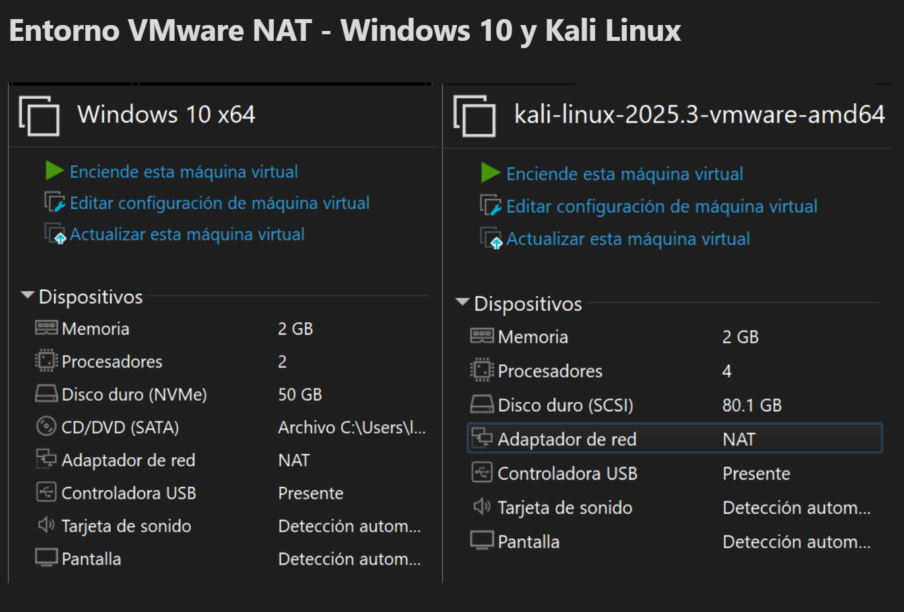
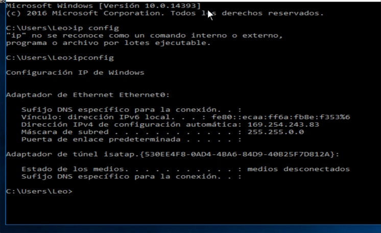
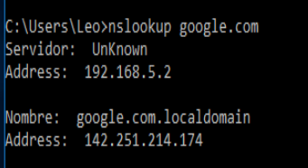
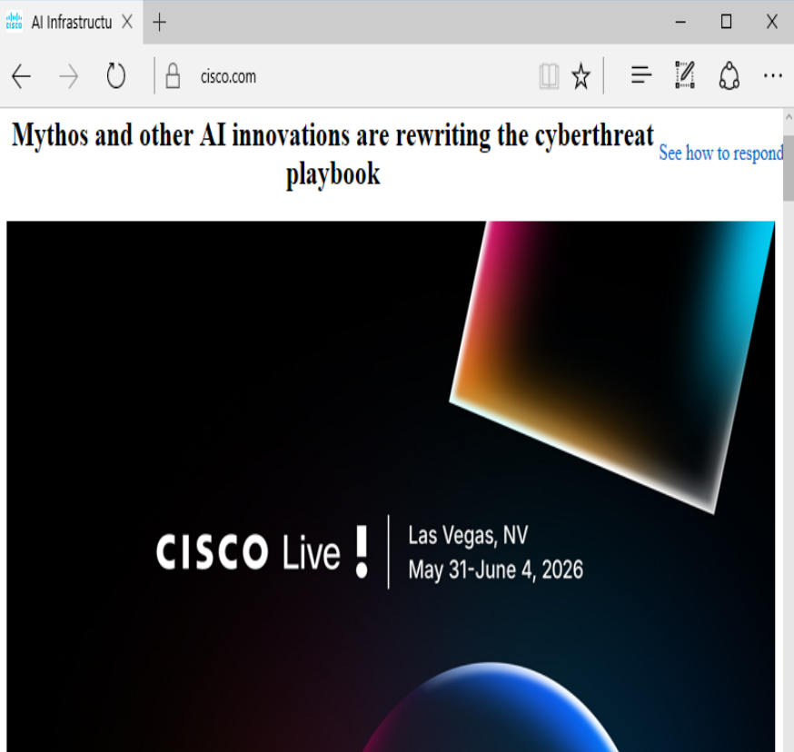

# Diagnóstico básico de conectividad en entorno VMware

**Estado:** Completado  
**Área:** Soporte TI / Help Desk / Redes básicas  
**Entorno:** VMware NAT con Windows 10 y Kali Linux  

---

## Escenario

Se utiliza una máquina virtual Windows 10 como equipo cliente simulado dentro de un entorno controlado en VMware, junto con una máquina Kali Linux como equipo técnico de apoyo para pruebas de red.

El caso simula un reporte de usuario con problemas de conectividad. El objetivo es aplicar un procedimiento básico de diagnóstico para revisar configuración IP, conectividad local, salida a internet y resolución DNS, sin exponer información sensible de una red doméstica o corporativa real.

---

## Evidencia del entorno

Ambas máquinas virtuales fueron configuradas dentro de una red **VMware NAT**.



---

## Problema inicial detectado

En la máquina Windows 10 se identificó una dirección IP automática tipo **APIPA**:

```text
169.254.x.x
```

Esto indica que el equipo tenía DHCP habilitado, pero no recibió una dirección IP válida desde el servicio DHCP de la red virtual.



Al intentar hacer ping desde Windows hacia Kali Linux, la prueba falló.


---

## Diagnóstico

La máquina Kali Linux sí obtuvo una IP válida dentro de la red NAT de VMware:

```text
192.168.5.131
```

Mientras tanto, Windows tenía una IP `169.254.x.x`, sin puerta de enlace válida.  
Esto confirmó que Windows no estaba correctamente dentro de la red NAT o no había recibido configuración DHCP válida.

---

## Corrección aplicada

Se corrigió la configuración del adaptador de red de la máquina Windows y se renovó la configuración IP con los siguientes comandos:

```cmd
ipconfig /release
ipconfig /renew
ipconfig
```


Después de renovar la configuración, Windows recibió una IP válida:

```text
Windows 10: 192.168.5.130
Gateway: 192.168.5.2
Kali Linux: 192.168.5.131
```


---

## Validación de conectividad

### 1. Ping al gateway VMware NAT

Se validó conectividad entre Windows 10 y el gateway NAT de VMware.

```cmd
ping 192.168.5.2
```


---

### 2. Ping desde Windows hacia Kali Linux

Se validó comunicación entre ambas máquinas virtuales dentro del entorno NAT.

```cmd
ping 192.168.5.131
```


---

### 3. Ping hacia internet

Se validó salida a internet usando una dirección IP pública.

```cmd
ping 8.8.8.8
```


---

### 4. Resolución DNS

Se validó resolución de nombres usando `nslookup`.

```cmd
nslookup google.com
```



---

### 5. Prueba de ruta con tracert

Se ejecutó `tracert` hacia `8.8.8.8`.

```cmd
tracert 8.8.8.8
```

El primer salto respondió correctamente desde el gateway NAT de VMware:

```text
192.168.5.2
```

Los saltos posteriores mostraron tiempo de espera agotado, lo cual puede deberse a filtrado ICMP/TTL en la ruta. Como las pruebas de `ping 8.8.8.8` y `nslookup google.com` fueron exitosas, se confirma que la conectividad a internet y la resolución DNS funcionaban correctamente.


---

## Validación visual de navegación web

Finalmente, se validó navegación web desde la máquina Windows 10 dentro del entorno VMware NAT.



---

## Resultado final

El problema de conectividad fue diagnosticado y corregido correctamente.

La causa principal fue que la máquina Windows 10 no tenía una configuración IP válida dentro de la red NAT de VMware, obteniendo inicialmente una dirección APIPA `169.254.x.x`.

Después de corregir la configuración de red y renovar DHCP, Windows obtuvo una IP válida `192.168.5.130`, pudo comunicarse con Kali Linux, alcanzar el gateway NAT, salir a internet y resolver nombres DNS.

---

## Habilidades demostradas

- Diagnóstico básico de conectividad.
- Identificación de dirección APIPA.
- Validación de DHCP.
- Uso de comandos `ipconfig`, `ping`, `tracert` y `nslookup`.
- Pruebas de conectividad entre máquinas virtuales.
- Validación de salida a internet.
- Documentación técnica orientada a soporte TI y Help Desk.
