# Caso Help Desk: Equipo lento al iniciar sesión en Windows

## Objetivo

Documentar un caso de soporte técnico en Windows donde un equipo presenta lentitud al iniciar sesión, consumo irregular de CPU y carga de programas innecesarios al inicio.

El objetivo del laboratorio es practicar un flujo realista de Help Desk: revisión inicial, diagnóstico por interfaz gráfica, corrección controlada, validación de rendimiento y documentación del caso.

## Escenario

Un usuario reporta que su equipo tarda en quedar listo después de iniciar sesión. Para el laboratorio se creó una condición controlada agregando programas al inicio de Windows, con el fin de simular un escenario común de lentitud al arrancar sesión.

Durante la revisión también se detectó consumo irregular de CPU, advertencias en Windows Update, archivos temporales acumulados y archivos dañados del sistema reparados mediante SFC.

El caso se trabajó en una máquina virtual con Windows 10, usando herramientas integradas del sistema operativo.

## Entorno utilizado

* Sistema operativo: Windows 10
* Entorno: Máquina virtual
* Herramientas:

  * Administrador de tareas
  * Configuración de Windows
  * Windows Update
  * Seguridad de Windows / Microsoft Defender
  * Solucionador de problemas de Windows
  * Símbolo del sistema como administrador
  * Comando `sfc /scannow`

## Procedimiento realizado

### 1. Revisión de programas configurados al inicio

Se revisó la carpeta de inicio de Windows y se identificaron programas configurados para abrirse automáticamente al iniciar sesión.

Esta condición fue creada de forma controlada para simular un caso realista donde el usuario tiene varias aplicaciones cargando al arranque.

**Evidencia:**

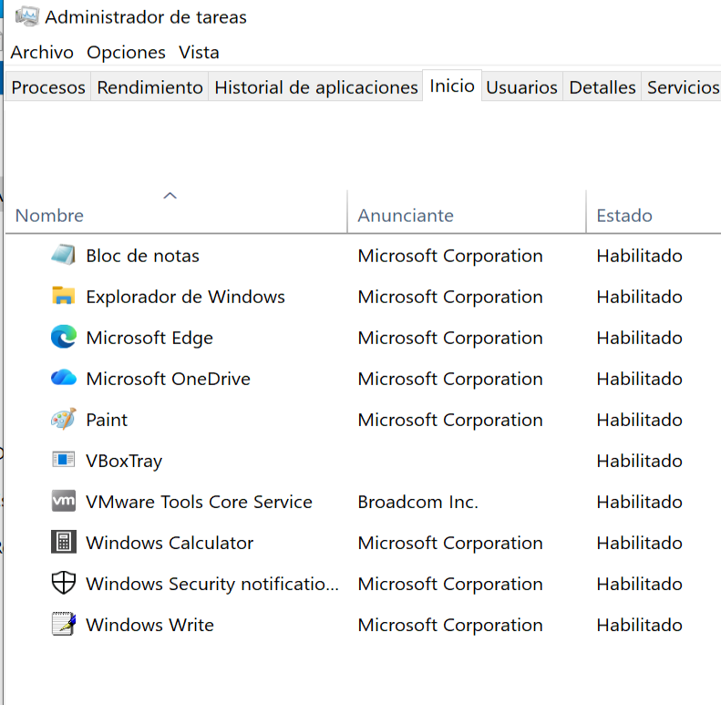

---

### 2. Deshabilitación de programas no esenciales

Se abrió el Administrador de tareas y se revisó la pestaña **Inicio**.

Se deshabilitaron aplicaciones innecesarias del inicio para reducir la carga al iniciar sesión. No se deshabilitaron componentes importantes relacionados con la máquina virtual ni con la seguridad del sistema, como VMware Tools, VBoxTray o Windows Security.

**Evidencia:**

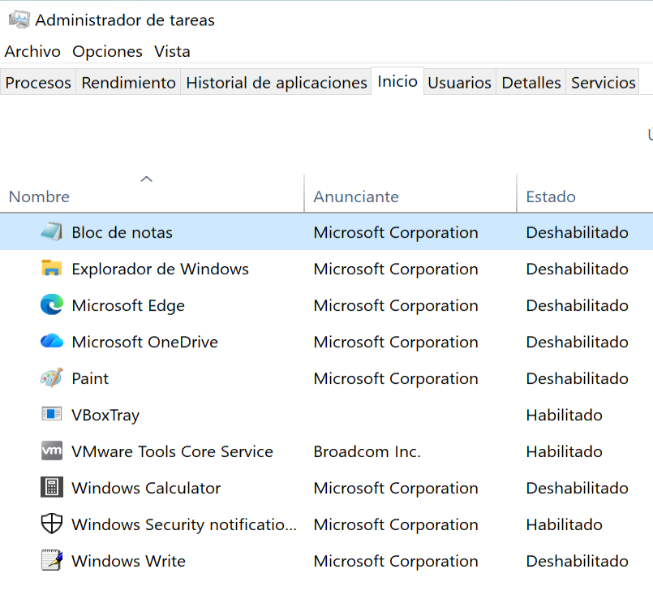

---

### 3. Revisión inicial de rendimiento

Después de reiniciar el equipo, se revisó el rendimiento desde el Administrador de tareas.

Se observó consumo elevado de CPU, llegando al 100%, con memoria y disco en uso moderado.

**Evidencia:**

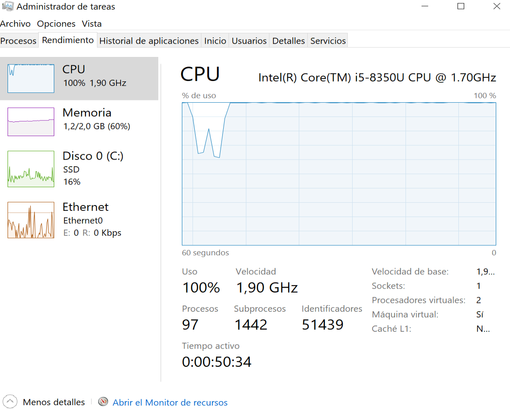

---

### 4. Identificación de proceso con alto consumo

Se revisó la pestaña **Procesos** ordenando por consumo de CPU.

Se identificó que **Noticias e intereses** estaba generando un consumo alto de CPU y disco, por lo que se desactivó desde la barra de tareas.

**Evidencia:**

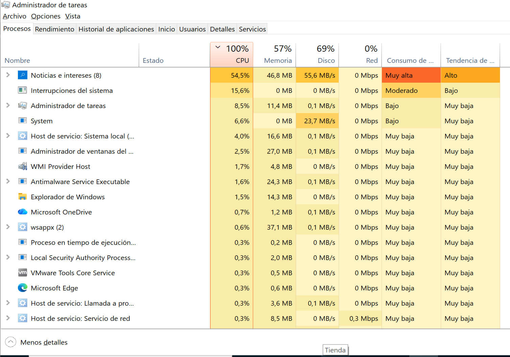

---

### 5. Validación después de desactivar Noticias e intereses

Después de desactivar Noticias e intereses, se revisó nuevamente el Administrador de tareas.

El proceso ya no aparecía consumiendo recursos, pero el CPU seguía presentando variaciones por servicios del sistema.

**Evidencia:**

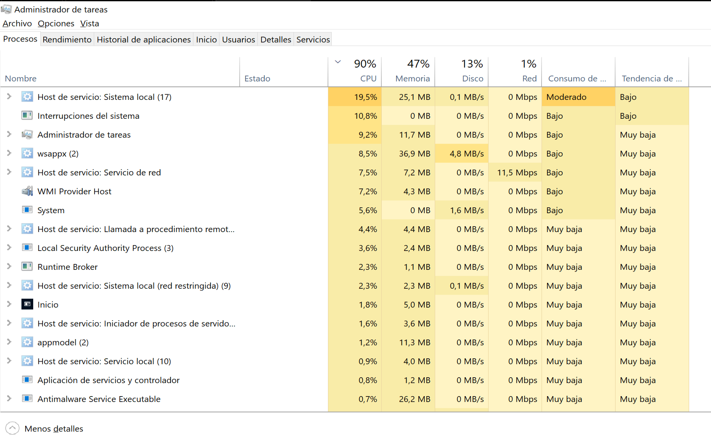

---

### 6. Revisión de CPU inestable

Se continuó monitoreando el consumo de CPU y se observó comportamiento irregular: el uso subía y bajaba constantemente.

Los procesos principales correspondían a servicios del sistema, por lo que no se cerraron manualmente para evitar afectar Windows.

**Evidencia:**

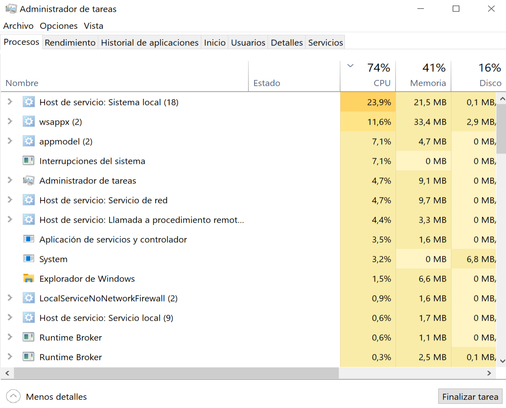

---

### 7. Revisión de Windows Update

Se revisó Windows Update y se encontró una advertencia indicando que faltaban correcciones importantes de seguridad y calidad.

Inicialmente apareció un error relacionado con el proceso de actualización.

**Evidencia:**

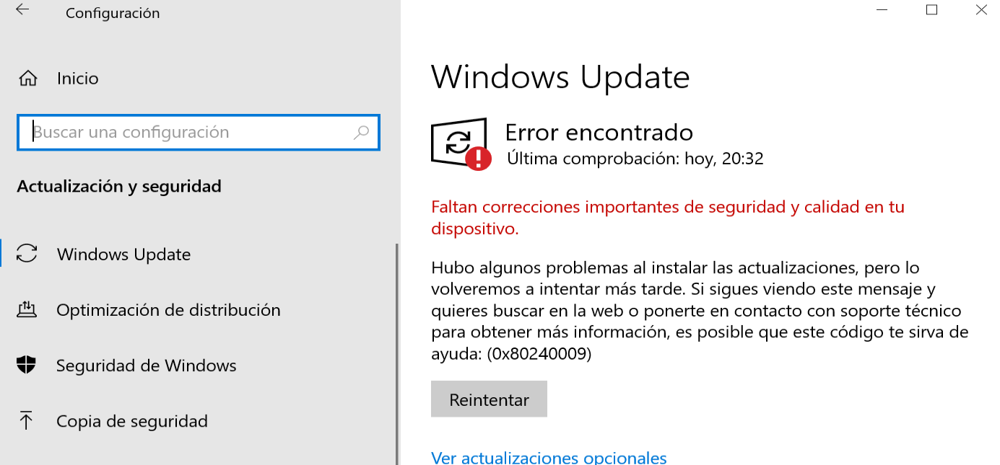

---

### 8. Reintento de actualización

Se intentó buscar actualizaciones nuevamente desde la interfaz gráfica. Windows seguía mostrando que no estaba todo actualizado.

**Evidencia:**

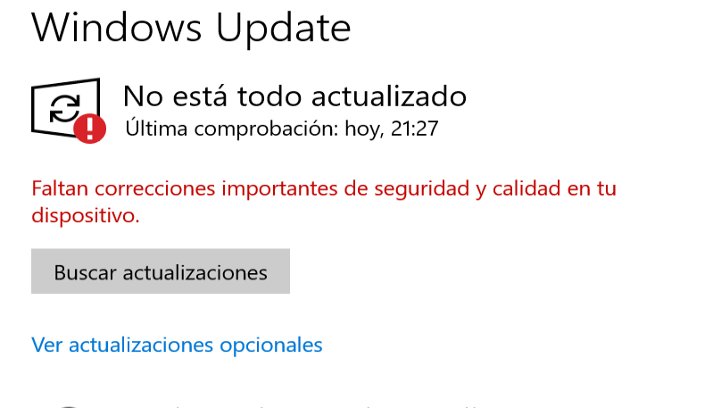

---

### 9. Validación de intentos fallidos

Después de varios intentos, Windows Update seguía mostrando el mismo estado sin completar la actualización.

Se decidió no seguir repitiendo la misma acción y continuar con validaciones adicionales.

**Evidencia:**

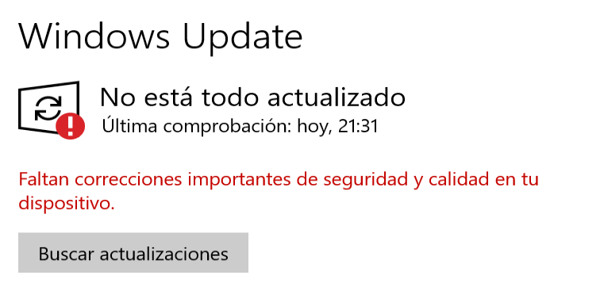

---

### 10. Revisión de CPU, memoria y disco

Se revisó nuevamente el rendimiento del equipo.

El CPU seguía presentando actividad, pero la memoria no estaba completamente saturada. La máquina virtual tenía 2 GB de RAM asignados y 2 procesadores virtuales, lo cual puede influir en el rendimiento durante tareas de actualización o reparación del sistema.

**Evidencia:**

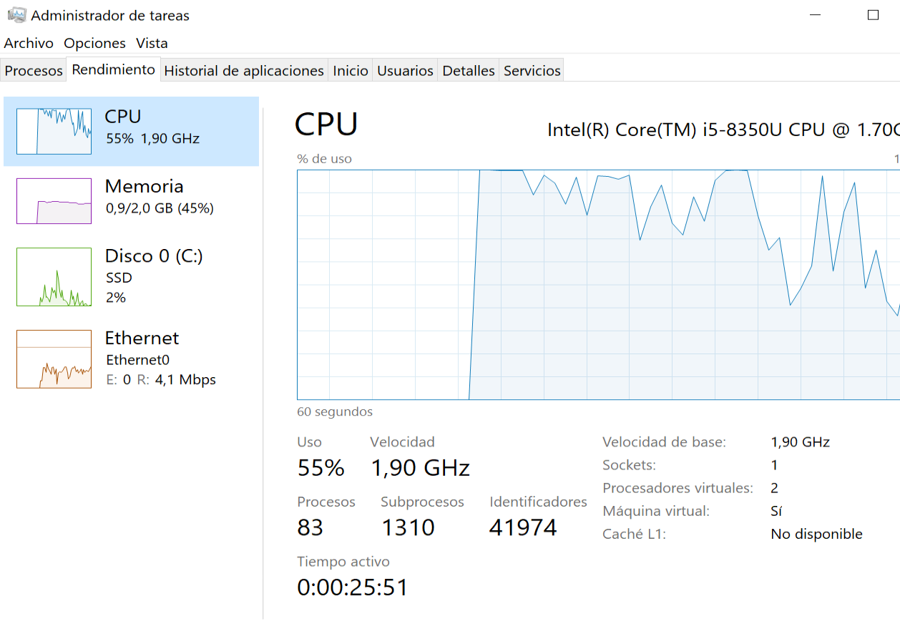

---

### 11. Revisión de almacenamiento disponible

Se revisó el almacenamiento del disco local.

El equipo tenía espacio disponible suficiente, por lo que la lentitud no parecía estar causada por falta crítica de espacio.

**Evidencia:**

---

### 12. Revisión de archivos temporales

Se revisó la sección de archivos temporales y se detectó una cantidad considerable de archivos temporales y archivos de instalaciones anteriores de Windows.

No se eliminaron archivos críticos sin validación, especialmente porque el sistema todavía presentaba inconsistencias con Windows Update.

**Evidencia:**

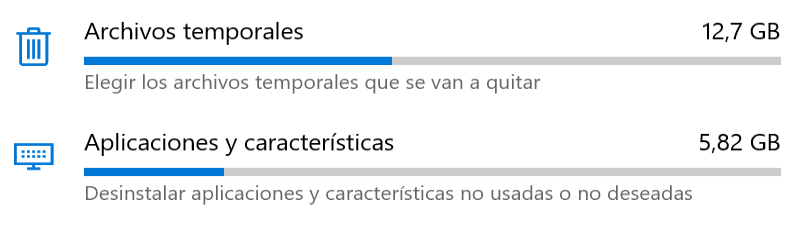

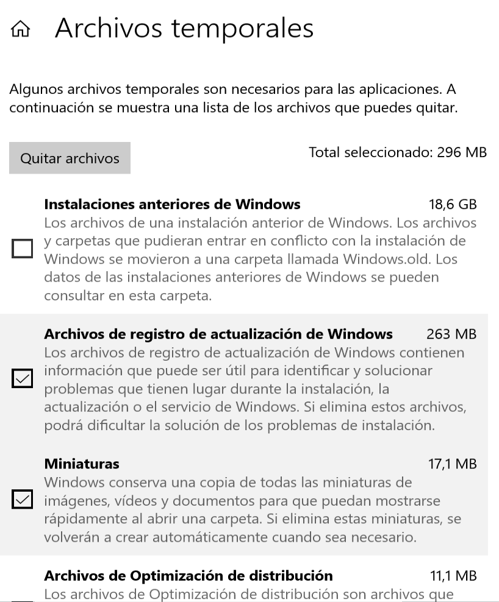

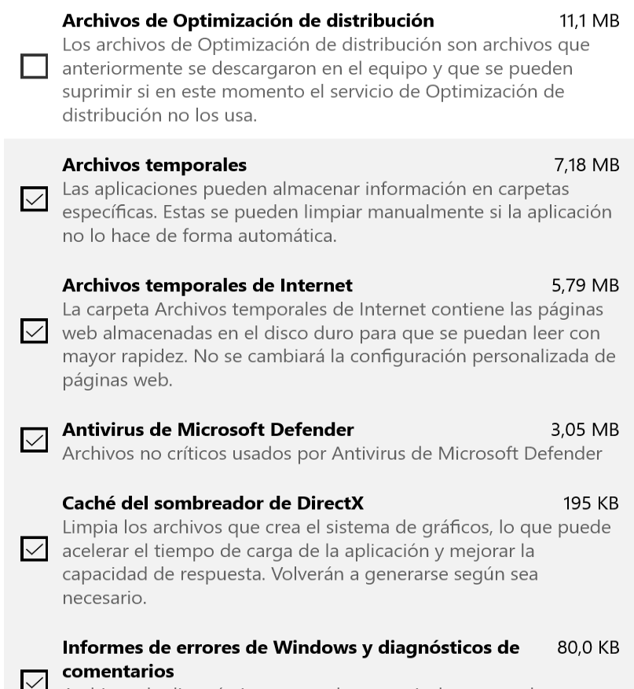

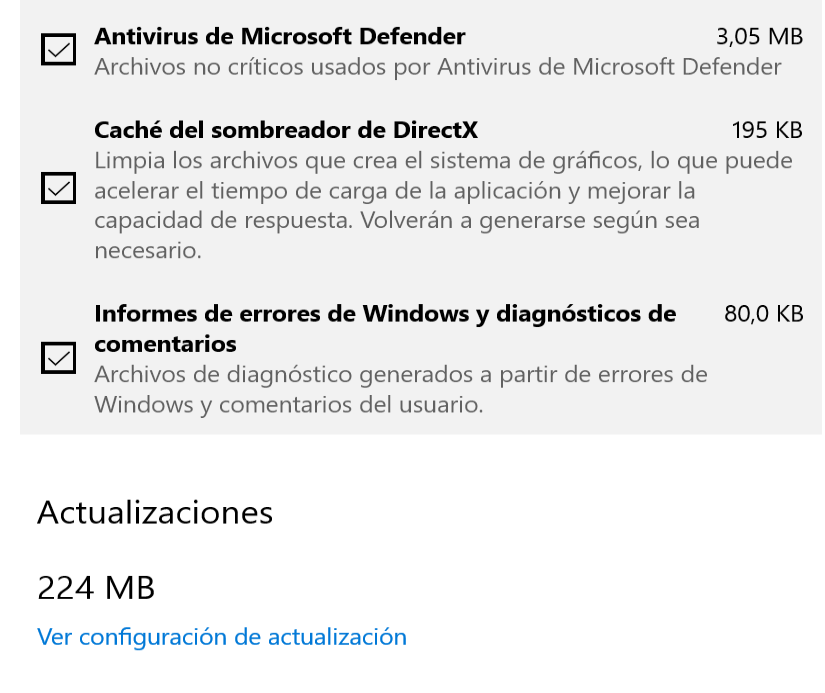

---

### 13. Ejecución del solucionador de problemas

Se ejecutó el solucionador de problemas de Windows Update desde la interfaz gráfica.

El solucionador no pudo identificar el problema.

**Evidencia:**

---

### 14. Revisión del historial de actualizaciones

Se revisó el historial de actualizaciones para identificar si existía una actualización específica fallida.

Las actualizaciones visibles aparecían como instaladas correctamente, por lo que se documentó una inconsistencia entre el estado principal de Windows Update y el historial.

**Evidencia:**

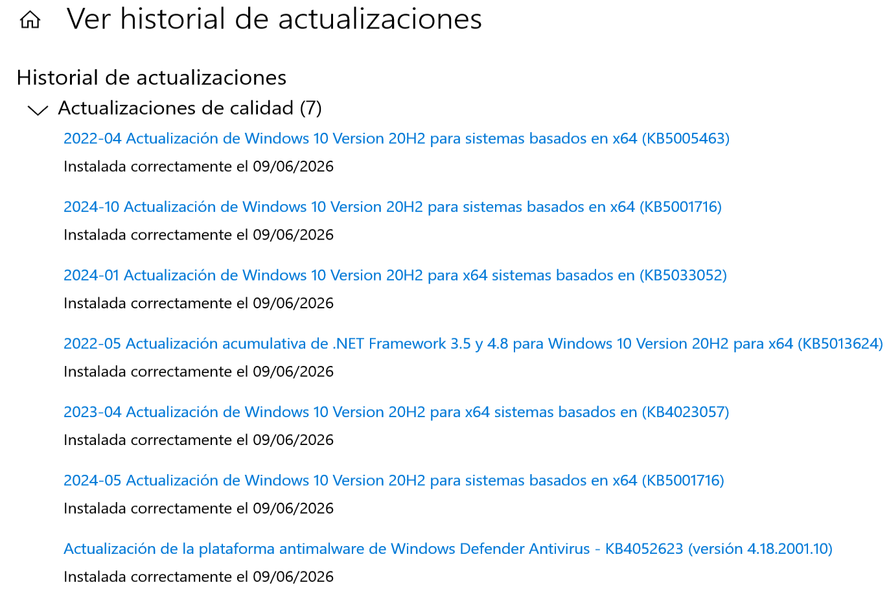

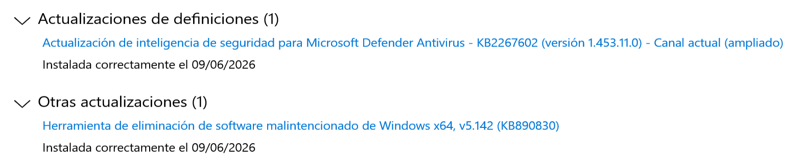

---

### 15. Revisión de actualizaciones opcionales

Se revisaron las actualizaciones opcionales.

Se encontró un controlador opcional de Broadcom, pero no se instaló porque no estaba relacionado directamente con la lentitud ni con el síntoma principal reportado.

**Evidencia:**

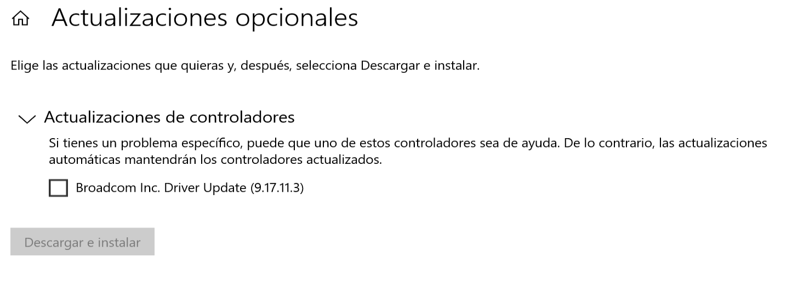

---

### 16. Examen rápido con Windows Defender

Se ejecutó un examen rápido con Microsoft Defender para descartar amenazas básicas como posible causa de lentitud.

El resultado indicó que no se encontraron amenazas.

**Evidencia:**

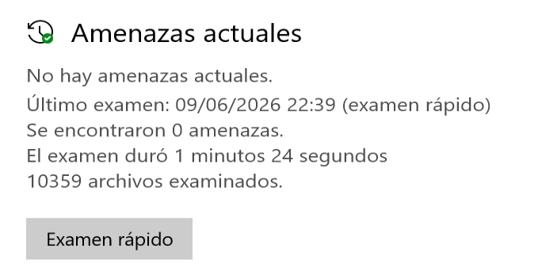

---

### 17. Revisión y reparación de archivos del sistema

Se ejecutó el comando `sfc /scannow` desde el Símbolo del sistema como administrador.

El resultado indicó que Protección de recursos de Windows encontró archivos dañados y los reparó correctamente.

Comando utilizado:

`sfc /scannow`

**Evidencia:**

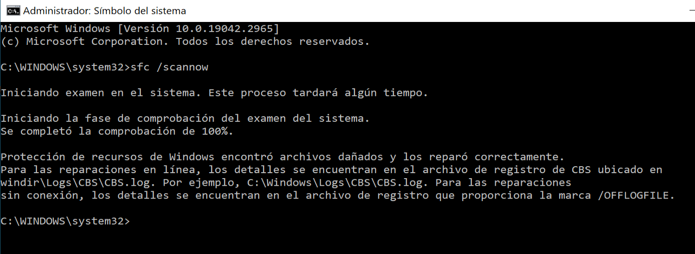

---

### 18. Validación final

Después de reiniciar el equipo, se revisó nuevamente el Administrador de tareas.

El consumo de CPU bajó de forma notable en comparación con las mediciones anteriores, mostrando una mejora en el rendimiento general.

**Evidencia:**

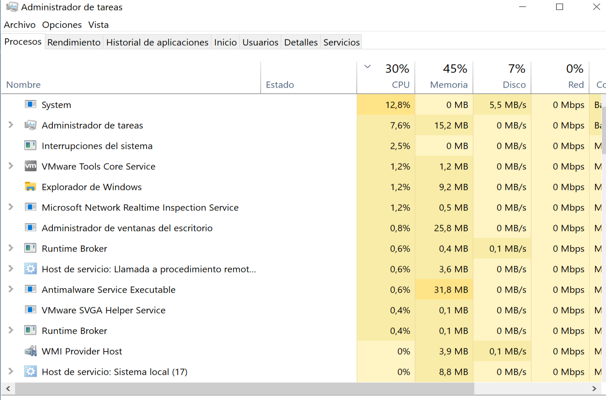

## Resultado

Se logró mejorar el rendimiento del equipo después de:

* Deshabilitar aplicaciones innecesarias al inicio.
* Desactivar Noticias e intereses por consumo alto de recursos.
* Verificar el estado de CPU, memoria, disco y almacenamiento.
* Revisar Windows Update e identificar inconsistencias.
* Validar que no había amenazas activas con Windows Defender.
* Ejecutar `sfc /scannow` para reparar archivos dañados del sistema.
* Reiniciar y validar mejora en el consumo de CPU.

El equipo quedó en mejor estado operativo después de la intervención.

## Estado del caso

Resuelto con observación.

El rendimiento mejoró después de las acciones aplicadas, pero Windows Update mostró una inconsistencia que debe mantenerse en observación si vuelve a presentar errores.

## Nota técnica

No se cerraron procesos críticos del sistema manualmente, ya que varios consumos altos correspondían a servicios internos de Windows. En un entorno real, cerrar servicios del sistema sin validar la causa podría generar inestabilidad o pérdida de información.

También se evitó eliminar archivos de instalaciones anteriores de Windows sin una validación previa, ya que podrían ser necesarios para recuperación o reversión del sistema.

## Valor laboral del laboratorio

Este laboratorio demuestra habilidades prácticas de Soporte TI / Help Desk, incluyendo:

* Diagnóstico de lentitud en Windows.
* Uso del Administrador de tareas.
* Revisión de aplicaciones de inicio.
* Validación de consumo de CPU, memoria y disco.
* Revisión de almacenamiento y archivos temporales.
* Uso básico de Windows Defender.
* Revisión de Windows Update.
* Ejecución de reparación básica con `sfc /scannow`.
* Documentación técnica de hallazgos, acciones y validación final.

## Conclusión

El caso permitió practicar un flujo realista de soporte técnico: recibir un reporte de lentitud, revisar causas probables, aplicar correcciones seguras, evitar acciones riesgosas sobre procesos del sistema y validar el resultado final con evidencia.

La mejora del rendimiento después de la reparación de archivos del sistema y la reducción de aplicaciones al inicio confirma la importancia de combinar diagnóstico visual, herramientas integradas de Windows y documentación clara del proceso.

