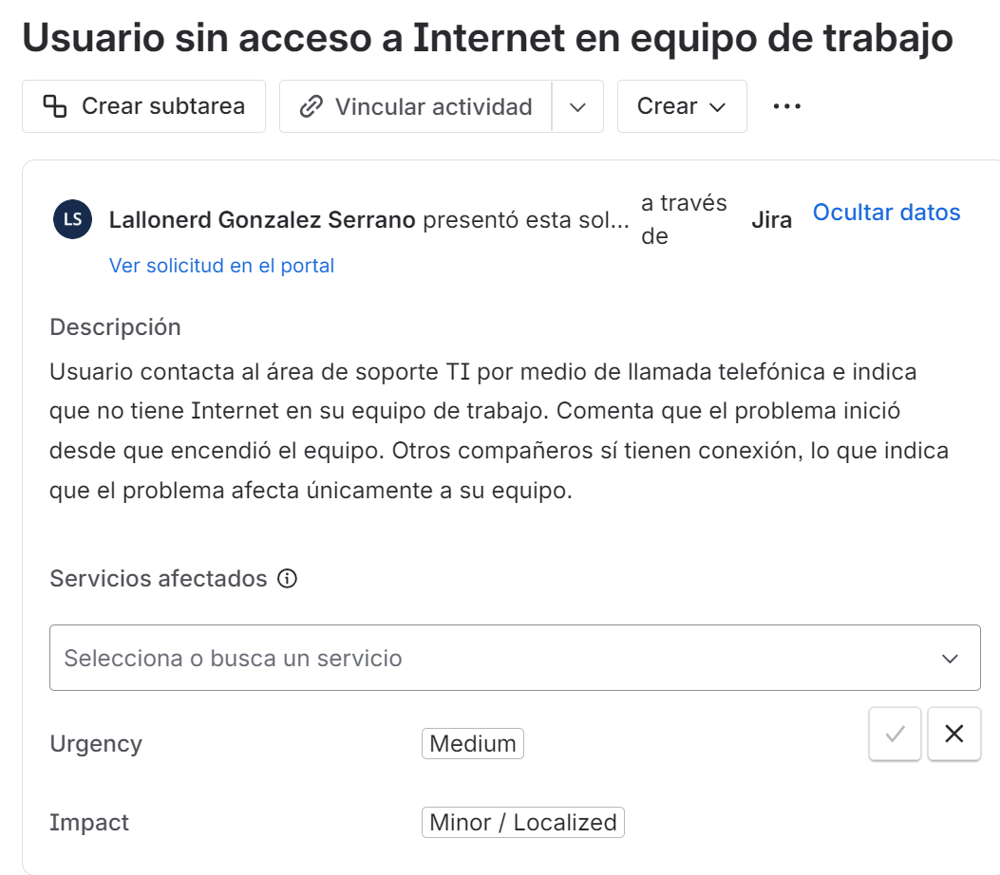
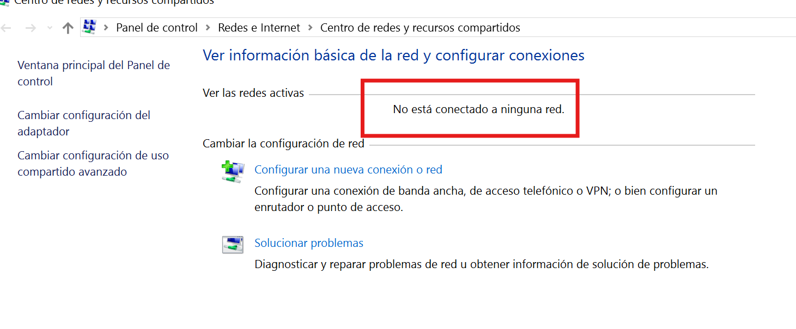
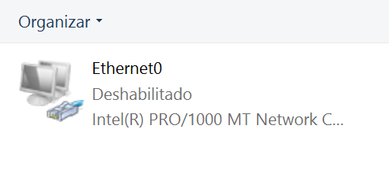
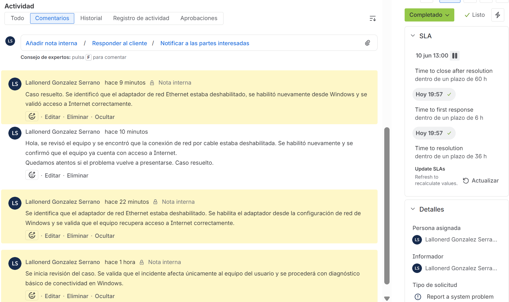

# Caso Help Desk en Jira Service Management: usuario sin acceso a Internet

## Objetivo

Documentar un caso de soporte técnico gestionado en Jira Service Management, desde la recepción del incidente hasta el cierre del ticket.

El caso consiste en atender a un usuario que reporta no tener acceso a Internet en su computadora de trabajo. Se registra el ticket, se clasifica el impacto y la urgencia, se realiza diagnóstico básico en Windows, se identifica la causa del problema, se aplica la solución y se valida que el servicio funcione correctamente.

## Herramientas y entorno utilizado

- Jira Service Management
- Windows 10
- Panel de control de Windows
- Navegador web
- VMware Workstation como entorno de práctica

## Escenario del caso

Un usuario contacta al área de soporte TI por medio de llamada telefónica e indica que no tiene Internet en su equipo de trabajo.

Durante la revisión inicial se confirma que otros compañeros sí tienen conexión, por lo que el incidente parece afectar únicamente a ese equipo.

## Registro del ticket

El caso se registró en Jira Service Management como un incidente de soporte.

Clasificación inicial:

- Tipo de solicitud: Report a system problem
- Estado inicial: En investigación
- Urgencia: Medium
- Impacto: Minor / Localized
- Persona asignada: Lallonerd González Serrano

## Diagnóstico inicial

Se revisó el estado de conexión en Windows y se observó que el equipo mostraba una X roja en el ícono de red.

Luego se revisó el estado de red desde el Centro de redes y recursos compartidos. Windows indicaba que el equipo no estaba conectado a ninguna red.

## Hallazgo

Al revisar la configuración del adaptador de red, se encontró que el adaptador Ethernet estaba deshabilitado.

## Solución aplicada

Se habilitó nuevamente el adaptador Ethernet desde la configuración de red de Windows.

## Validación

Después de habilitar el adaptador, se abrió el navegador y se confirmó que el equipo recuperó acceso a Internet correctamente.

## Cierre del ticket

Se respondió al usuario indicando que el problema fue corregido y se dejó una nota interna con la causa identificada y la solución aplicada.

El ticket quedó en estado completado dentro de Jira Service Management.

## Conclusión

Este caso demuestra un flujo básico de atención Help Desk: recepción del incidente, registro en una herramienta de tickets, clasificación del impacto, diagnóstico en Windows, solución del problema, validación del servicio y cierre documentado del caso.

El problema fue causado por el adaptador de red Ethernet deshabilitado. La solución consistió en habilitar nuevamente el adaptador y confirmar que el equipo recuperó acceso a Internet.
