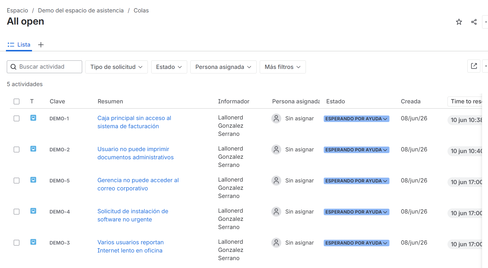
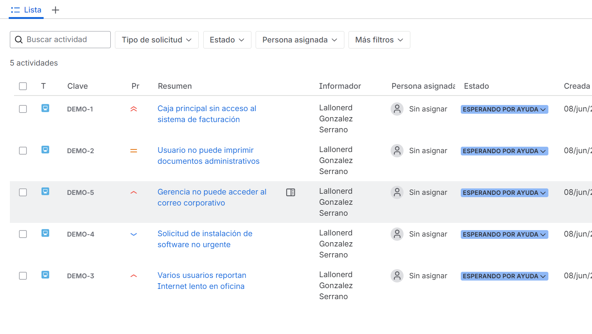
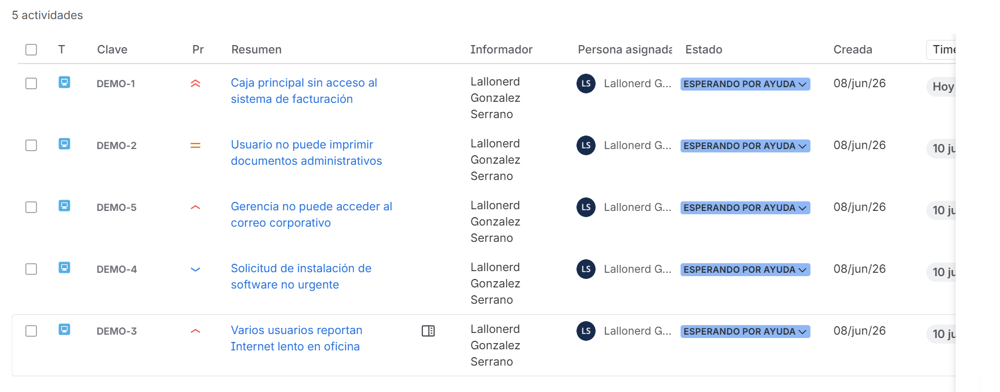
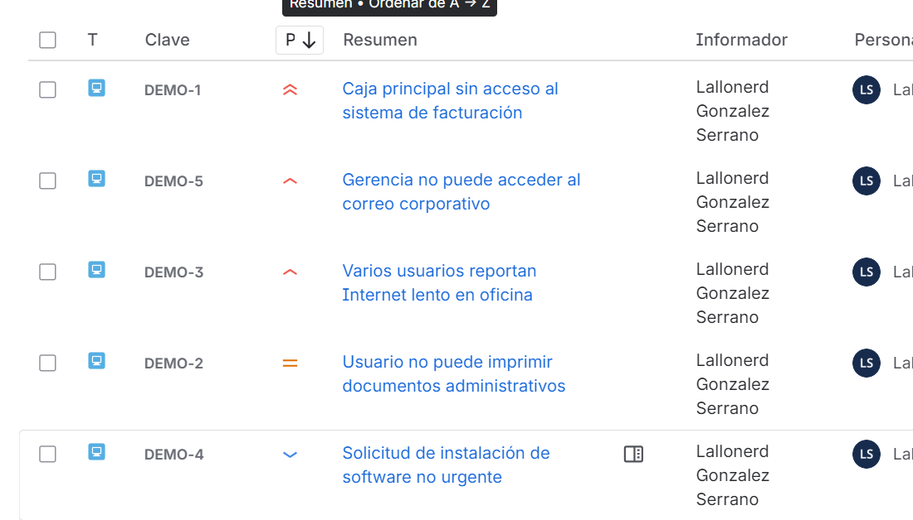

# Caso Help Desk: Priorización de tickets por impacto, urgencia y SLA

## Objetivo

Documentar un caso práctico de Help Desk donde se reciben varios tickets al mismo tiempo y se deben organizar según impacto, urgencia y prioridad operativa.

Este laboratorio muestra cómo un técnico de soporte puede revisar una cola de trabajo, clasificar solicitudes, asignarse los casos y ordenar la atención para atender primero los incidentes más críticos.

## Herramienta utilizada

* Jira Service Management

## Escenario

Se recibe una cola con cinco solicitudes abiertas relacionadas con soporte técnico.
El objetivo es revisar cada ticket, analizar su impacto operativo y asignar una prioridad adecuada antes de iniciar la atención técnica.

Los casos trabajados fueron:

| Ticket | Solicitud                                            | Prioridad asignada |
| ------ | ---------------------------------------------------- | ------------------ |
| DEMO-1 | Caja principal sin acceso al sistema de facturación  | Highest            |
| DEMO-5 | Gerencia no puede acceder al correo corporativo      | High               |
| DEMO-3 | Varios usuarios reportan Internet lento en oficina   | High               |
| DEMO-2 | Usuario no puede imprimir documentos administrativos | Medium             |
| DEMO-4 | Solicitud de instalación de software no urgente      | Low                |

## Criterio usado para priorizar

Para ordenar los tickets se tomó en cuenta:

* Impacto sobre la operación.
* Cantidad de usuarios afectados.
* Urgencia del caso.
* Posible afectación a clientes, ventas o comunicación interna.
* Diferencia entre incidente operativo y solicitud no urgente.

## Desarrollo del laboratorio

### 1. Creación de tickets en la cola

Se crearon cinco solicitudes en Jira Service Management para representar una cola de trabajo de soporte técnico.

### 2. Asignación de prioridades

Se revisó cada ticket y se asignó una prioridad según su impacto y urgencia.

### 3. Asignación al técnico

Los tickets fueron asignados al técnico responsable para simular la gestión de una cola de trabajo propia.

### 4. Orden de atención

La cola fue ordenada por prioridad para atender primero los casos con mayor impacto operativo.

## Análisis de prioridades

### DEMO-1 — Caja principal sin acceso al sistema de facturación

Se asignó prioridad **Highest** porque afecta directamente el proceso de facturación y puede detener la atención de clientes en caja.

### DEMO-5 — Gerencia no puede acceder al correo corporativo

Se asignó prioridad **High** porque afecta a un usuario clave y puede retrasar comunicación importante, aprobaciones o coordinación operativa.

### DEMO-3 — Varios usuarios reportan Internet lento en oficina

Se asignó prioridad **High** porque afecta a varios usuarios y puede impactar la productividad del área, aunque el servicio no esté completamente caído.

### DEMO-2 — Usuario no puede imprimir documentos administrativos

Se asignó prioridad **Medium** porque afecta una tarea de trabajo, pero inicialmente no se confirma impacto a varios usuarios ni interrupción completa del área.

### DEMO-4 — Solicitud de instalación de software no urgente

Se asignó prioridad **Low** porque corresponde a una solicitud planificable que requiere validación de autorización, licencia y horario de instalación.

## Resultado

La cola quedó organizada de mayor a menor prioridad:

1. DEMO-1 — Highest
2. DEMO-5 — High
3. DEMO-3 — High
4. DEMO-2 — Medium
5. DEMO-4 — Low

Esto permite atender primero los incidentes con mayor impacto operativo y dejar las solicitudes no urgentes para una gestión programada.

## Habilidades practicadas

* Gestión de tickets en Jira Service Management.
* Priorización por impacto y urgencia.
* Organización de cola de trabajo.
* Documentación de notas internas.
* Asignación de tickets al técnico responsable.
* Análisis básico de SLA y continuidad operativa.
* Criterio práctico para soporte técnico nivel junior.

## Nota

Este laboratorio no utiliza información real de clientes ni datos sensibles. Las solicitudes fueron creadas para practicar un flujo realista de priorización en un entorno de Help Desk.
