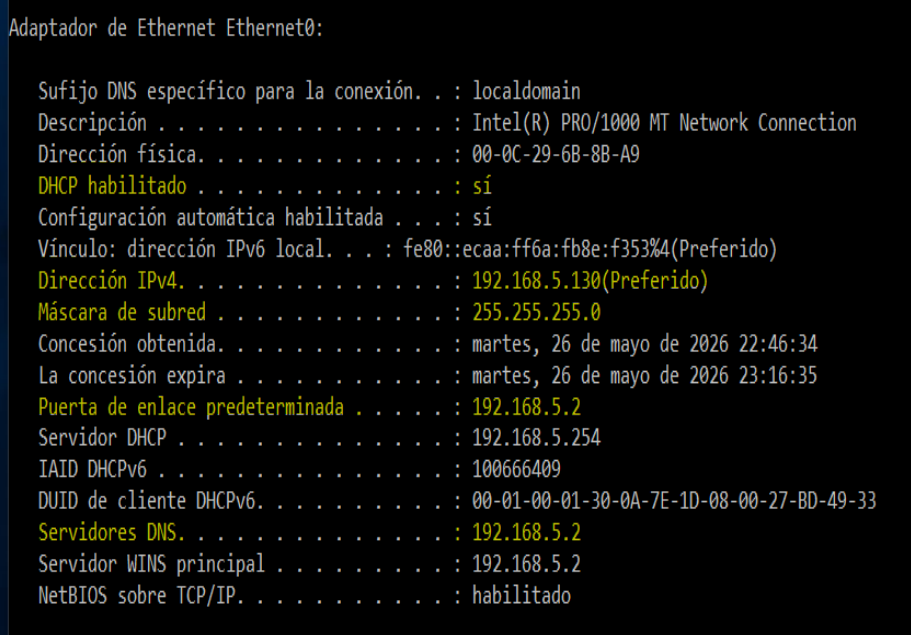
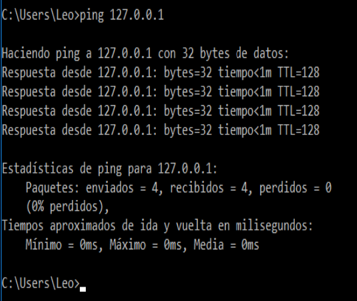
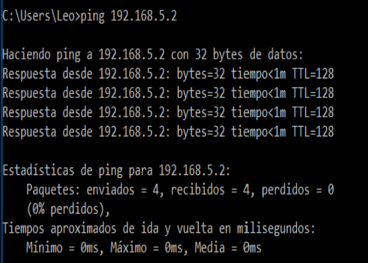
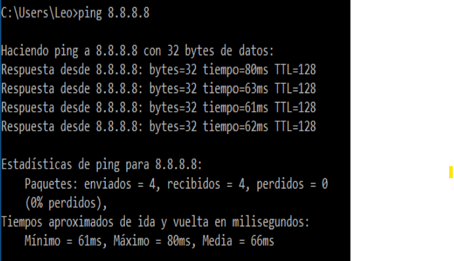
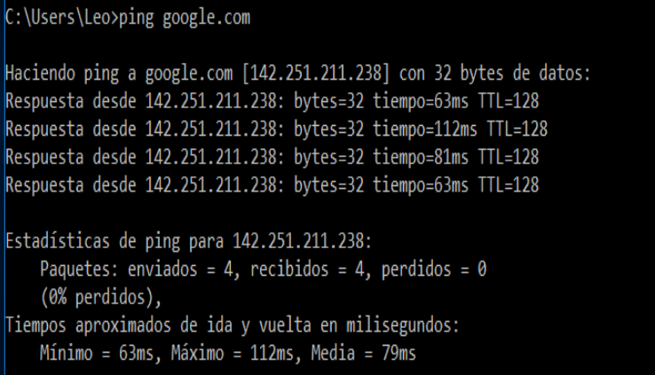
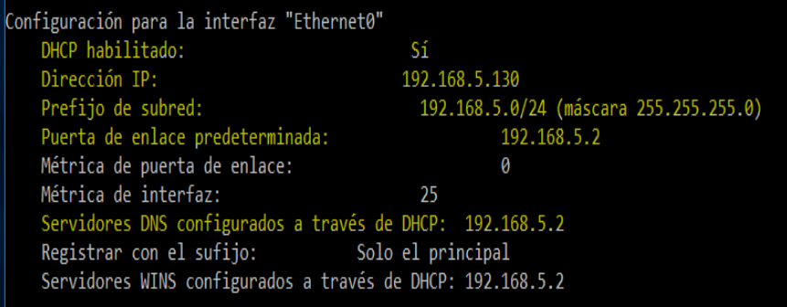

# Revisión de configuración IP en Windows

## Objetivo

Verificar la configuración IP de un equipo Windows para confirmar si la dirección IP, máscara de subred, puerta de enlace, DNS y DHCP están configurados correctamente.

Este laboratorio forma parte de mi portafolio técnico de **Soporte TI, Help Desk y diagnóstico de red**.

---

## Escenario

Se realiza una revisión básica de configuración IP en un equipo Windows.

El objetivo es validar si el equipo recibió correctamente su configuración de red mediante DHCP y comprobar si tiene:

- Configuración IPv4 válida.
- Comunicación con la pila TCP/IP local.
- Comunicación con la puerta de enlace.
- Salida a Internet por dirección IP.
- Resolución de nombres mediante DNS.

---

## Herramientas utilizadas

- Windows CMD
- `ipconfig`
- `ping`
- `netsh`

---

## Evidencia 01: Revisión de configuración IP con `ipconfig /all`

Se ejecutó el comando:

```cmd
ipconfig /all
```

Este comando permite revisar la configuración completa del adaptador de red.



### Resultado observado

- DHCP habilitado: Sí
- Dirección IPv4: 192.168.5.130
- Máscara de subred: 255.255.255.0
- Puerta de enlace predeterminada: 192.168.5.2
- Servidor DNS: 192.168.5.2

### Análisis

El equipo recibió una configuración IP válida mediante DHCP.  
La dirección IP pertenece a la red `192.168.5.0/24`, por lo que coincide con la puerta de enlace configurada.

---

## Evidencia 02: Prueba de pila TCP/IP local

Se ejecutó el comando:

```cmd
ping 127.0.0.1
```

Esta prueba permite verificar si la pila TCP/IP local del sistema operativo funciona correctamente.



### Resultado observado

- Paquetes enviados: 4
- Paquetes recibidos: 4
- Paquetes perdidos: 0
- Pérdida: 0%

### Análisis

La prueba fue exitosa.  
Esto confirma que la pila TCP/IP local de Windows funciona correctamente.

---

## Evidencia 03: Prueba de comunicación con la puerta de enlace

Se ejecutó el comando:

```cmd
ping 192.168.5.2
```

Esta prueba permite confirmar si el equipo puede comunicarse con la puerta de enlace o gateway de la red.



### Resultado observado

- Paquetes enviados: 4
- Paquetes recibidos: 4
- Paquetes perdidos: 0
- Pérdida: 0%

### Análisis

El equipo se comunica correctamente con la puerta de enlace `192.168.5.2`.

Esto indica que la comunicación dentro de la red local funciona correctamente.

---

## Evidencia 04: Prueba de salida a Internet por dirección IP

Se ejecutó el comando:

```cmd
ping 8.8.8.8
```

Esta prueba permite verificar si el equipo tiene salida a Internet utilizando una dirección IP externa.



### Resultado observado

- Paquetes enviados: 4
- Paquetes recibidos: 4
- Paquetes perdidos: 0
- Pérdida: 0%
- Tiempo promedio aproximado: 66 ms

### Análisis

El equipo tiene salida a Internet por dirección IP.

Esto confirma que la configuración de IP, máscara, gateway y ruta hacia Internet funcionan correctamente.

---

## Evidencia 05: Prueba de resolución DNS

Se ejecutó el comando:

```cmd
ping google.com
```

Esta prueba permite validar si el equipo puede resolver nombres de dominio mediante DNS.



### Resultado observado

- El dominio `google.com` fue resuelto correctamente a una dirección IP.
- Paquetes enviados: 4
- Paquetes recibidos: 4
- Paquetes perdidos: 0
- Pérdida: 0%

### Análisis

La resolución DNS funciona correctamente.

El equipo puede comunicarse con Internet tanto por dirección IP como por nombre de dominio.

---

## Evidencia 06: Revisión de configuración IPv4 con `netsh`

Se ejecutó el comando:

```cmd
netsh interface ipv4 show config
```

Este comando permite revisar de forma más específica la configuración IPv4 del adaptador de red.



### Resultado observado

- DHCP habilitado: Sí
- Dirección IP: 192.168.5.130
- Prefijo de subred: 192.168.5.0/24
- Puerta de enlace predeterminada: 192.168.5.2
- DNS configurado mediante DHCP: 192.168.5.2
- WINS configurado mediante DHCP: 192.168.5.2

### Análisis

La configuración IPv4 observada con `netsh` coincide con la información obtenida previamente mediante `ipconfig /all`.

Esto confirma que la configuración fue asignada correctamente por DHCP.

---

## Conclusión

No se detectaron errores en la configuración IP del equipo.

El equipo recibió correctamente su configuración mediante DHCP, tiene comunicación con la pila TCP/IP local, comunicación con la puerta de enlace, salida a Internet por IP y resolución DNS funcional.

Este laboratorio demuestra un proceso básico de verificación de red utilizado en tareas de **Soporte TI y Help Desk** antes de escalar un incidente.

---

## Habilidades demostradas

- Revisión de configuración IP en Windows.
- Validación de DHCP.
- Verificación de gateway.
- Prueba de conectividad local.
- Prueba de salida a Internet.
- Validación básica de DNS.
- Documentación técnica con evidencias.
