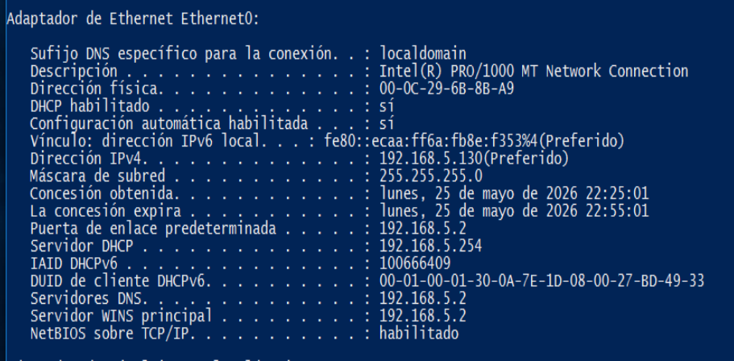
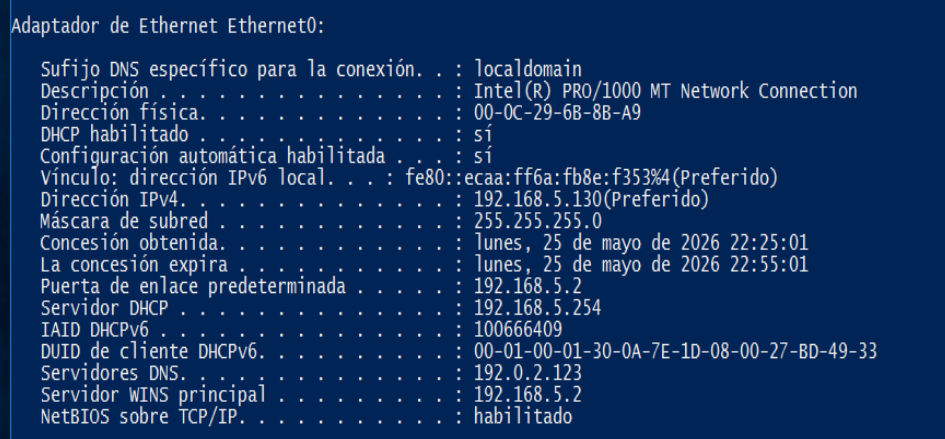
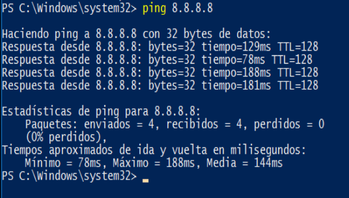
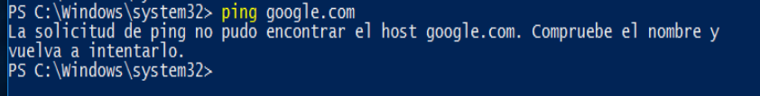
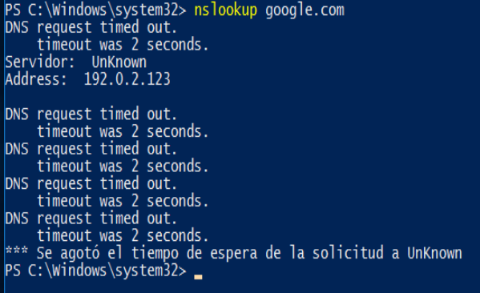
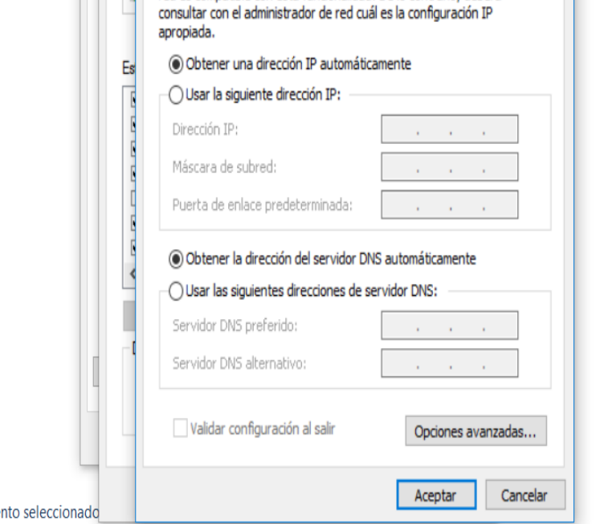
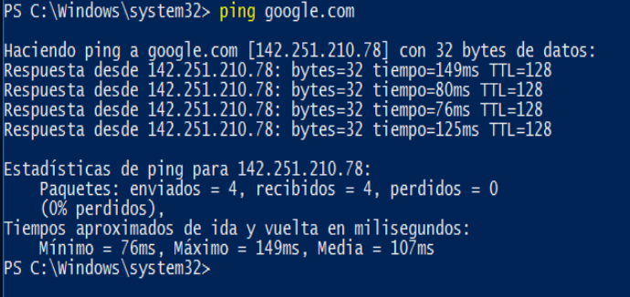
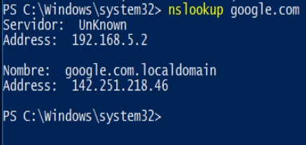

# Corrección de fallo DNS en Windows

## Objetivo

Diagnosticar y corregir un problema de resolución DNS en Windows, aplicando un proceso básico de soporte técnico junior.

## Escenario

Caso práctico de laboratorio orientado a soporte TI.

El equipo tiene conexión de red, pero no puede cargar páginas web por nombre de dominio. El objetivo es revisar si el problema está relacionado con conectividad general o con resolución DNS.

## Problema detectado

Durante la revisión se observó que el equipo tenía conectividad por dirección IP, pero fallaba al resolver dominios como `google.com`.

Esto indica que la conexión de red funcionaba, pero existía un problema relacionado con DNS.

## Herramientas utilizadas

- Windows 10
- PowerShell / CMD
- Configuración de red de Windows
- Comandos básicos de diagnóstico

## Proceso realizado

### 1. Revisión de configuración de red

Se revisó la configuración IP del equipo con el comando `ipconfig /all`.

Esto permitió identificar la dirección IP, puerta de enlace y servidor DNS configurado.

### 2. Identificación del DNS configurado

Se identificó que el equipo tenía configurado un servidor DNS que no respondía correctamente.

### 3. Prueba de conectividad por IP

Se realizó una prueba hacia una IP pública usando `ping 8.8.8.8`.

La prueba respondió correctamente, por lo que se confirmó que el equipo sí tenía conectividad de red.

### 4. Prueba de resolución por dominio

Luego se realizó una prueba usando el nombre de dominio `google.com` con el comando `ping google.com`.

La prueba falló porque el equipo no pudo encontrar el host.

### 5. Confirmación del fallo DNS

Se utilizó el comando `nslookup google.com`.

La consulta agotó el tiempo de espera usando el servidor DNS configurado, confirmando un problema de resolución DNS.

### 6. Corrección aplicada

Se corrigió la configuración DNS desde las propiedades IPv4 del adaptador de red, dejando la opción de obtener DNS automáticamente.

Después se limpió la caché DNS local con el comando `ipconfig /flushdns`.

### 7. Validación final

Se repitieron las pruebas de resolución por dominio usando `ping google.com` y `nslookup google.com`.

Después de la corrección, el dominio resolvió correctamente y respondió a las pruebas.

## Resultado

El problema fue identificado como un fallo de resolución DNS.

La conectividad por IP funcionaba correctamente, pero el equipo no podía resolver nombres de dominio debido a un DNS que no respondía.

Después de corregir la configuración DNS y limpiar la caché local, el equipo volvió a resolver dominios correctamente.

## Conclusión

Este laboratorio demuestra un proceso básico de diagnóstico y corrección de DNS en Windows.

El procedimiento permite diferenciar entre un problema de conectividad general y un problema específico de resolución de nombres, usando pruebas comunes de soporte técnico junior.
